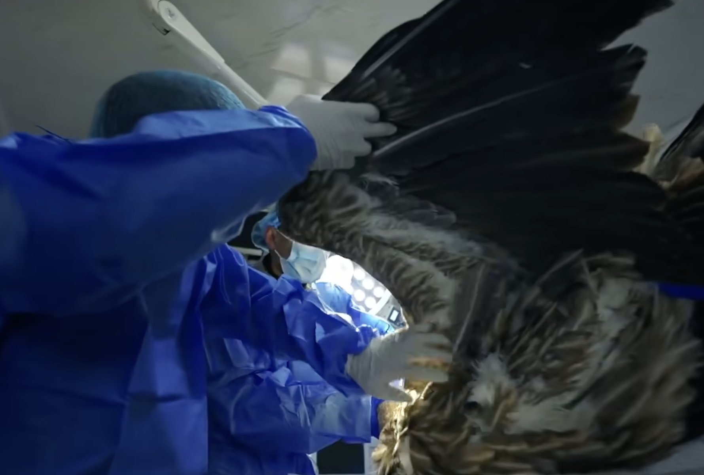
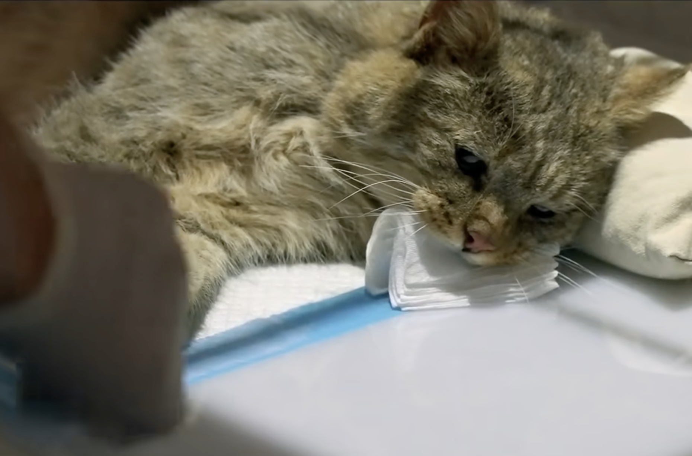

```{r setup, include=FALSE}
knitr::opts_chunk$set(
  echo   = FALSE, message = FALSE, warning = FALSE)
library(flexdashboard)
library(tidyverse)
library(hms)
library(lubridate)
library(viridis)
library(ggthemes)
library(scales)
library(glmnet)
library(patchwork)
```


```{r, include=FALSE}
park_ranger = read_csv("data/Urban_Park_Ranger_Animal_Condition_Response_20251103.csv") %>% 
  janitor::clean_names() %>% 
  mutate(
    date_and_time_of_initial_call = mdy_hm(date_and_time_of_initial_call),
    date_and_time_of_ranger_response = mdy_hm(date_and_time_of_ranger_response),
    
    call_date = as.Date(date_and_time_of_initial_call),
    call_time = as_hms(date_and_time_of_initial_call),
    response_date = as.Date(date_and_time_of_ranger_response),
    response_time = as_hms(date_and_time_of_ranger_response)
  ) %>% 
  filter(date_and_time_of_ranger_response >= date_and_time_of_initial_call) %>% 
  rename(duration_of_action = duration_of_response)

park_ranger_new = park_ranger %>% 
  mutate(
    animal_class_new = case_when(
      animal_class %in% c(
        "[\"Birds\"]", "[\"Raptors\"]", "Birds", "Raptors", 
        "Raptors, Small Mammals-RVS"
      ) ~ "Birds / Raptors",
            
      animal_class %in% c(
        "[\"Small Mammals-non RVS\"]", "[\"Small Mammals-RVS\"]",
        "Small Mammals-non RVS", "Small Mammals-RVS"
      ) ~ "Small Mammals",
      
      animal_class %in% c(
        "Coyotes", "Deer", "[\"Coyotes\"]", "[\"Deer\"]"
      ) ~ "Large Mammals",

      animal_class %in% c(
        "[\"Marine Mammals-whales, Dolphin\"]", "[\"Marine Mammals-seals only\"]",
        "Marine Mammals-seals only", "Marine Mammals-whales,  Dolphin", 
        "Marine Mammals-whales, Dolphin"
      ) ~ "Marine Mammals",
            
      animal_class %in% c(
        "[\"Fish-numerous quantity\"]", "[\"Non Native Fish-(invasive)\"]", 
        "Fish-numerous quantity", "Fish-numerous quantity;#Terrestrial Reptile or Amphibian", 
        "Non Native Fish-(invasive)"
      ) ~ "Fish",
      
      animal_class %in% c(
        "[\"Marine Reptiles\"]", "[\"Terrestrial Reptile or Amphibian\"]", 
        "Marine Reptiles", "Terrestrial Reptile or Amphibian", 
        "Terrestrial Reptile or Amphibian, Fish-numerous quantity"
      ) ~ "Reptiles / Amphibians",

      animal_class %in% c(
        "[\"Rare, Endangered, Dangerous\"]", "Rare,  Endangered,  Dangerous",
        "Rare, Endangered, Dangerous"
      ) ~ "Others",
      
      species_description %in% c(
        "Atlantic Canary","Bird (Unknown)","Budgerigar","Budgerigar Parakeet",
        "Chicken","Chukar","Cockatiel","Domestic Dove","Domestic Duck", "Domestic duck",
        "Domestic Goose","Domestic Goose Hybrid","Domestic Quail","Domestic Turkey",
        "Domestic Waterfowl","Fancy Dove","Guinea Fowl","Guineafowl","Japanese Quail",
        "Khaki Campbell","Muscovy Duck","Rock Dove",
        "Parakeet (Unknown)"
      ) ~ "Birds / Raptors",
      
      species_description %in% c(
        "Domestic Rabbit","Domestic Ferret","Fancy Rat","Gerbil",
        "Guinea Pig", "Guniea Pig", "Guinea pig", "Hamster"
      ) ~ "Small Mammals",
      
      species_description %in% c(
        "Dog","Pitt Bull Mix","Cat","Goat","Cattle","Pig"
      ) ~ "Large Mammals",
      
      species_description %in% c(
        "Animal (Unknown)","Honey Bee", "Unknown","N/A"
      ) ~ "Others"),
    
    animal_class_new = factor(animal_class_new, 
                              levels = c("Birds / Raptors", "Small Mammals", "Large Mammals", 
                                         "Marine Mammals", "Reptiles / Amphibians", "Fish", "Others")),
    
    borough = factor(borough, levels = c("Manhattan", "Brooklyn", "Queens", "Bronx", "Staten Island")),
    
    call_source = factor(call_source, levels = c("Public", "Central", "Employee", 
                                                 "Conservancies/\"Friends of\" Groups", 
                                                 "Observed by Ranger", "WBF", "WINORR", "Other")),
    
    species_status = ifelse(species_status == "N/A" | is.na(species_status), 
                            "Unknown", species_status),
    species_status = factor(species_status, levels = c("Native", "Invasive", "Domestic", 
                                                       "Exotic", "Unknown")),
    
    animal_condition = ifelse(animal_condition == "N/A" | is.na(animal_condition), 
                              "Unknown", animal_condition),
    animal_condition = factor(animal_condition, levels = c("Healthy", "Unhealthy", "Injured", 
                                                           "DOA", "Unknown")),
    
    adult   = if_else(str_detect(age, "Adult"), 1L, 0L, missing = 0L),
    juvenile = if_else(str_detect(age, "Juvenile"), 1L, 0L, missing = 0L),
    infant  = if_else(str_detect(age, "Infant"), 1L, 0L, missing = 0L)
  )
```

We examined response duration and final ranger actions to understand how different types of wildlife incidents demand time and effort from Urban Park Rangers. By comparing duration across action types, animal conditions, and action–condition combinations, we can identify which situations require intensive intervention, which are resolved quickly, and where uncertainty or coordination challenges lead to variability. Assessing distribution patterns and statistical differences also helps clarify operational drivers behind long responses and supports more informed planning and resource allocation within the ranger system.

```{r, echo=FALSE, results='asis'}
cat('
<div style="text-align: center;">
  
  <p style="font-size:12px; color:gray; margin-top:4px;">
    Source: the documentary XiYe
  </p>
</div>
')
```


## Response Duration by Final Ranger Action

```{r, fig.width=7, fig.height=5, fig.align = "center"}
park_model = park_ranger_new |>
  rename(num_animals = matches("animals")) |>
  mutate(
    duration_hours      = as.numeric(duration_of_action),
    num_animals         = as.numeric(num_animals),
    final_ranger_action = as.factor(final_ranger_action),
    animal_condition    = as.factor(animal_condition)
  ) |>
  filter(
    !is.na(duration_hours),
    duration_hours > 0,
    !is.na(final_ranger_action),
    !is.na(animal_condition),
    !is.na(num_animals),
    num_animals >= 0
  )

action_order <- park_model |>
  group_by(final_ranger_action) |>
  summarise(med = median(duration_hours, na.rm = TRUE)) |>
  arrange(med) |>
  pull(final_ranger_action)

park_model2 <- park_model |>
  mutate(final_ranger_action = factor(final_ranger_action, levels = action_order))

ggplot(park_model2, aes(x = final_ranger_action, y = duration_hours)) +

  # Violin plot
  geom_violin(trim = FALSE, fill = "#BFCDE0", color = "#5D7CA6", alpha = 0.5, scale = "width") +

  # Boxplot
  geom_boxplot(width = 0.5, fill = "white", outlier.alpha = 0.3) +

  coord_flip() +

  labs(
    title = "Distribution of Response Duration by Final Ranger Action",
    x = "Final Ranger Action (sorted by median duration)",
    y = "Duration of Response (hours)"
  ) +

  theme_bw() +
  theme(
    plot.title = element_text(hjust = 0.5),
    axis.text.y = element_text(size = 8)
  )

```

The combined violin–boxplot shows clear differences in response duration across ranger actions.

Rehabilitation-related actions take the longest.
Categories such as “Released back into Park after Rehabilitation” and “Rehabilitator” have the highest medians and widest spreads, reflecting the need for assessment, coordination with rehabilitators, transport, and extended monitoring.

Administrative or low-intervention actions are short.
Actions like “Advised/Educated others,” “Submitted for DEC Testing,” “Relocated/Condition Corrected,” and “Monitored Animal” have much shorter, tightly clustered durations, consistent with quick assessments or minor interventions.

ACC and Unfounded responses show high variability.
ACC transfers sometimes take much longer due to coordination and handling challenges.
Unfounded cases are usually brief but occasionally long when searches, misreported calls, or verification require extra time.

Outliers represent rare long-duration events.
Several actions—especially ACC, Unfounded, and Rehabilitator—include outliers over 30 hours, likely due to long-term monitoring, repeated site visits, or delays in coordinating animal handoffs.

## Response Duration by Animal Condition

```{r, fig.width=6, fig.height=4, fig.align = "center"}
park_model <- park_ranger_new |>
  rename(num_animals = matches("animals")) |>
  mutate(
    duration_hours      = as.numeric(duration_of_action),
    num_animals         = as.numeric(num_animals),

    animal_condition    = as.character(animal_condition),
    animal_condition    = ifelse(animal_condition == "N/A", "Unknown", animal_condition),

    final_ranger_action = as.factor(final_ranger_action),
    animal_condition    = as.factor(animal_condition)
  ) |>
  filter(
    !is.na(duration_hours),
    duration_hours > 0,
    !is.na(final_ranger_action),
    !is.na(animal_condition),
    !is.na(num_animals),
    num_animals >= 0
  )

park_model2 <- park_model |>
  mutate(
    animal_condition = fct_reorder(
      animal_condition,
      duration_hours,
      .fun = median,
      na.rm = TRUE))

ggplot(park_model2, aes(x = animal_condition, y = duration_hours)) +
  # Violin layer
  geom_violin(trim = FALSE, fill = "#BFCDE0", color = "#5D7CA6",
              alpha = 0.5, scale = "width") +
  
  # Boxplot layer
  geom_boxplot(width = 0.5, fill = "white", outlier.alpha = 0.3) +
  
  coord_flip() +
  
  labs(
    title = "Distribution of Response Duration by Animal Condition",
    x = "Animal Condition",
    y = "Duration of Response (hours)"
  ) +
  
  theme_bw() +
  theme(
    plot.title = element_text(hjust = 0.5),
    axis.text.y = element_text(size = 8)
  )
```

The violin–boxplot shows how response duration differs across animal conditions.

Unhealthy and Injured animals require longer responses.
These categories have slightly higher medians and wider spreads, reflecting the need for careful assessment, safe handling, and possible coordination with rehabilitators.

Healthy animals receive shorter, more consistent responses.
Their durations are low and tightly clustered, consistent with quick checks, simple relocation, or brief observation.

Unknown conditions show high variability.
Durations range widely, including long outliers, likely because unclear reports require extra investigation before determining whether intervention is needed.

DOA cases are typically short but sometimes extended.
Most require minimal handling, but some last longer due to coordination with external agencies, species identification, or special disposal procedures.

## Distribution of Response Duration by Action Group
```{r}
park_model2 = park_model |>
  mutate(
    action_group = if_else(
      final_ranger_action == "Unfounded",
      "Unfounded",
      "Other actions"
    )
  )
duration_mean = park_model2 |>
  group_by(action_group) |>
  summarise(
    mean_duration = mean(duration_hours, na.rm = TRUE),
    .groups = "drop"
  )
duration_mean |>
  knitr::kable(
    digits = 3,
    caption = "Mean Duration by Action Group",
    align = "c"
  )
```

### Density of Raw Response Duration
```{r, fig.width=5, fig.height=3, fig.align = "center"}
ggplot(park_model2, aes(x = duration_hours,
                        fill  = action_group,
                        color = action_group)) +
  geom_density(alpha = 0.3, adjust = 1, linewidth = 1) +
  
  geom_vline(data = duration_mean,
             aes(xintercept = mean_duration, color = action_group),
             linewidth = 1.2) +
  
  labs(
    title = "Density of response duration by action group",
    x = "Duration of response (hours)",
    y = "Density",
    fill  = "Action group",
    color = "Action group"
  ) +
  theme_bw() +
  theme(
    plot.title = element_text(hjust = 0.5)
  )

```

The first density plot shows that the distribution of raw response duration is extremely right-skewed, with most incidents resolved within a short time but a small number taking many hours. This heavy skew makes it difficult to visually compare “Unfounded” cases with all other ranger actions on the original scale because the long tail compresses the main density near zero.

### Density of Log-Transformed Response Duration
```{r, fig.width=5, fig.height=3, fig.align = "center"}
park_model2_log = park_model2 |>
  filter(duration_hours > 0) |>
  mutate(duration_log = log1p(duration_hours))  # log(1 + x)

ggplot(park_model2_log,
       aes(x = duration_log, fill = action_group, color = action_group)) +
  geom_density(alpha = 0.4, adjust = 1, linewidth = 0.7) +
  labs(
    title = "Density of log-transformed response duration",
    x = "log(1 + duration of response, hours)",
    y = "Density",
    fill  = "Action group",
    color = "Action group"
  ) +
  theme_bw() +
  theme(
    plot.title = element_text(hjust = 0.5)
  )
```

To improve interpretability, we applied a log (1 + duration) transformation, which compresses long outliers and spreads the dense cluster near zero.

Unfounded cases：
These show higher density at lower log-duration values, indicating they are typically resolved quickly.
Their mean duration is about 1.0 hour, confirming short response times.

Other actions：
These have a broader distribution and greater density at higher log-duration values, reflecting the additional time required for assessment, handling, or coordination.
Their mean duration is higher at 1.52 hours.


## ANOVA Models for Response Duration

### ANOVA Using Raw Duration
```{r}
anova_fit = aov(
  duration_hours ~ final_ranger_action * animal_condition + num_animals,
  data = park_model
)

anova_raw_tbl <- broom::tidy(anova_fit) |>
  select(
    term,
    Df      = df,
    `Sum Sq`  = sumsq,
    `Mean Sq` = meansq,
    `F value` = statistic,
    `Pr(>F)`  = p.value
  )

knitr::kable(
  anova_raw_tbl,
  digits  = 3,
  caption = "ANOVA table for raw response duration",
  align   = "c"
)
```

The original ANOVA model
duration_hours ~ final_ranger_action * animal_condition + num_animals
shows clear differences in response duration.

Final ranger action is highly significant (p < 2e-16), indicating strong variation across action types.

Animal condition is not significant (p = 0.46) in the raw model.

Number of animals has no effect (p = 0.80).

The interaction is significant (p = 0.000165), meaning the impact of action type depends on the animal’s condition.


### ANOVA Using Log-Transformed Duration
```{r}
park_model2 = park_model |>
  filter(duration_hours > 0) |>
  mutate(log_duration = log(duration_hours))

anova_fit_log = aov(
  log_duration ~ final_ranger_action * animal_condition + num_animals,
  data = park_model2
)

anova_log_tbl <- broom::tidy(anova_fit_log) |>
  select(
    term,
    Df      = df,
    `Sum Sq`  = sumsq,
    `Mean Sq` = meansq,
    `F value` = statistic,
    `Pr(>F)`  = p.value
  )

knitr::kable(
  anova_log_tbl,
  digits  = 3,
  caption = "ANOVA table for log-transformed response duration",
  align   = "c"
)

par(mfrow = c(1, 2))
plot(anova_fit_log, which = 1)  # Residuals vs Fitted
plot(anova_fit_log, which = 2)  # Normal Q-Q
par(mfrow = c(1, 1))

```

Because response duration is highly right-skewed with many long outliers, the raw ANOVA violated assumptions. A log transformation was applied to stabilize variance and improve residual normality.

Model: log_duration ~ final_ranger_action * animal_condition + num_animals

Key results:

Final ranger action remains highly significant (p < 2e-16), indicating persistent differences in duration across action types.

Animal condition becomes significant (p = 0.000416), meaning condition effects become clearer after reducing skewness.

Number of animals is still non-significant (p = 0.27).

The interaction remains significant (p = 7.3e-07), showing that the effect of action type varies by condition.

The log transformation reduces extreme values and spreads out lower durations, yielding more homogeneous variance and more normally distributed residuals. Diagnostic plots show steadier variance and a Q–Q plot much closer to the reference line, with minor tail deviations expected in field data.


## Final Ranger Actions by Animal Condition

```{r}
park_model4 <- park_model |>
  filter(!is.na(animal_condition)) |>
  filter(animal_condition %in% c("Healthy", "Unhealthy", "Injured", "DOA"))
```

```{r}
plot_condition_bar <- function(data, cond, ymax) {

  df <- data |>
    filter(animal_condition == cond) |>
    count(final_ranger_action) |>
    arrange(n)

  df$final_ranger_action <- factor(df$final_ranger_action,
                                   levels = df$final_ranger_action)

  ggplot(df, aes(x = final_ranger_action, y = n)) +
    geom_col(fill = "#4F81BD", alpha = 0.85) +
    coord_flip() +
    scale_y_continuous(limits = c(0, ymax),
                       expand = expansion(mult = c(0, 0.05))) +
    labs(
      title = paste("Final Ranger Action for", cond),
      x = "Final Ranger Action",
      y = "Number of Cases") +
    theme_bw() +
    theme(
      plot.title = element_text(hjust = 0.5),
      axis.text.y = element_text(size = 8))
}
max_cases <- park_model4 |>
  count(animal_condition, final_ranger_action) |>
  pull(n) |>
  max()

p1 <- plot_condition_bar(park_model4, "Healthy",   max_cases)
p2 <- plot_condition_bar(park_model4, "Unhealthy", max_cases)
p3 <- plot_condition_bar(park_model4, "Injured",   max_cases)
p4 <- plot_condition_bar(park_model4, "DOA",       max_cases)

(p1 | p2) /
(p3 | p4)
```

The four-panel plot compares ranger actions across animal conditions.

Healthy animals：
Most cases involve Relocated/Condition Corrected or ACC, reflecting simple removal from unsafe areas or routine transfer for evaluation. Rehabilitation-related actions are rare because healthy animals seldom require intensive care.

Unhealthy animals：
ACC is the dominant response, followed by Rehabilitator, consistent with the need for medical assessment or long-term care. Actions like DEC Testing or relocation are infrequent, as relocation alone is usually inadequate for visibly unhealthy animals.

Injured animals：
Common actions include Rehabilitator, Unfounded, and ACC. Injured animals often need hands-on treatment, while higher Unfounded counts suggest that some animals could not be located or had recovered by the time rangers arrived.

DOA animals：
Relocated/Condition Corrected is the most frequent action, as dead animals primarily require removal from public spaces. Occasional ACC or DEC Testing cases reflect situations requiring identification or documentation before disposal.

```{r, echo=FALSE, results='asis'}
cat('
<div style="text-align: center;">
  
  <p style="font-size:12px; color:gray; margin-top:4px;">
    Source: the documentary XiYe
  </p>
</div>
')
```
