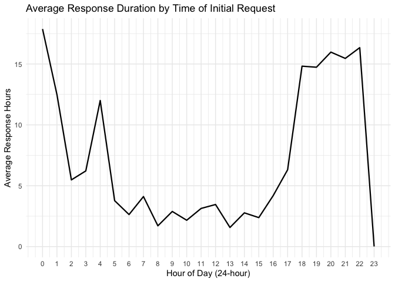
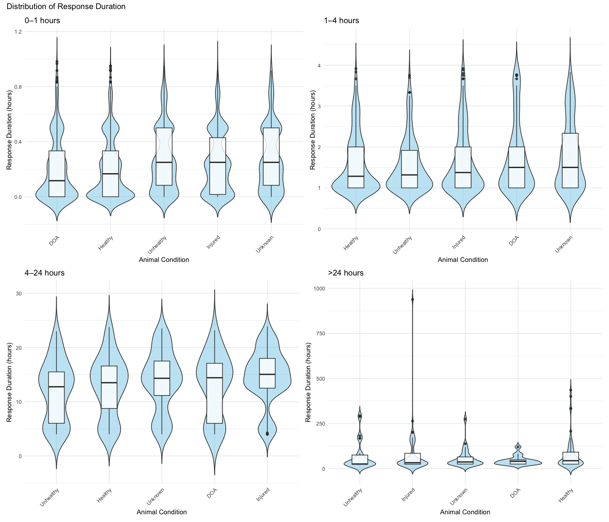
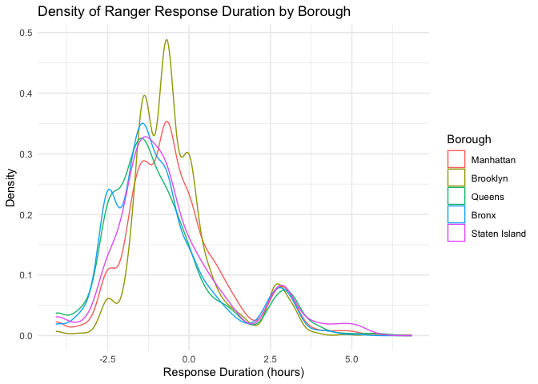
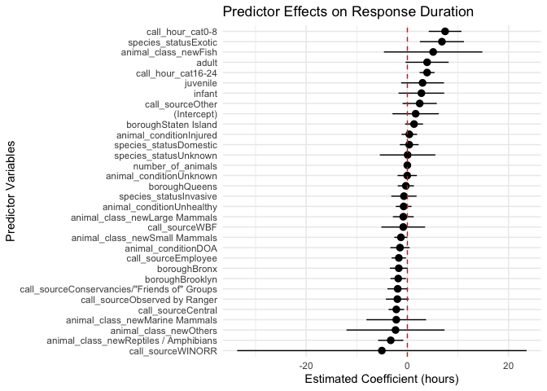

Project Report
================
Xinwei Han (xh2601), Xinhui Lin (xl3054), Ruohan Lyu (rl3610), Xinyin
Miao (xm2356), Fenglin Xie (fx2212)
2025-12-06

Load packages:

``` r
library(tidyverse)
library(hms)
library(lubridate)
library(viridis)
library(ggthemes)
library(scales)
library(glmnet)
library(patchwork)
```

# Motivation: Provide an overview of the project goals and motivation.

# Related work: Anything that inspired you, such as a paper, a web site, or something we discussed in class.

# Initial questions: What questions are you trying to answer? How did these questions evolve over the course of the project? What new questions did you consider in the course of your analysis?

# Data: Source, scraping method, cleaning, etc.

## Data Source

## Data cleaning process

- Split date and time

- Remove incorrect records based on call & response time

- Rename variable `duration_of_response` to `duration_of_action`

``` r
park_ranger = read_csv("data/Urban_Park_Ranger_Animal_Condition_Response_20251103.csv") %>% 
  janitor::clean_names() %>% 
  mutate(
    date_and_time_of_initial_call = mdy_hm(date_and_time_of_initial_call),
    date_and_time_of_ranger_response = mdy_hm(date_and_time_of_ranger_response),
    
    call_date = as.Date(date_and_time_of_initial_call),
    call_time = as_hms(date_and_time_of_initial_call),
    response_date = as.Date(date_and_time_of_ranger_response),
    response_time = as_hms(date_and_time_of_ranger_response)
  ) %>% 
  filter(date_and_time_of_ranger_response >= date_and_time_of_initial_call) %>% 
  rename(duration_of_action = duration_of_response)
```

    ## Rows: 6385 Columns: 22
    ## ── Column specification ─────────────────────────────────────
    ## Delimiter: ","
    ## chr (15): Date and Time of initial call, Date and time of Ranger response, B...
    ## dbl  (3): Duration of Response, # of Animals, Hours spent monitoring
    ## lgl  (4): PEP Response, Animal Monitored, Police Response, ESU Response
    ## 
    ## ℹ Use `spec()` to retrieve the full column specification for this data.
    ## ℹ Specify the column types or set `show_col_types = FALSE` to quiet this message.

- Reclassify animal classes into 7 categories: Birds / Raptors, Small
  Mammals, Large Mammals, Marine Mammals, Reptiles / Amphibians, Fish,
  Others

- Factor categorical variables & set reference level

``` r
park_ranger_new = park_ranger %>% 
  mutate(
    animal_class_new = case_when(
      animal_class %in% c(
        "[\"Birds\"]", "[\"Raptors\"]", "Birds", "Raptors", 
        "Raptors, Small Mammals-RVS"
      ) ~ "Birds / Raptors",
            
      animal_class %in% c(
        "[\"Small Mammals-non RVS\"]", "[\"Small Mammals-RVS\"]",
        "Small Mammals-non RVS", "Small Mammals-RVS"
      ) ~ "Small Mammals",
      
      animal_class %in% c(
        "Coyotes", "Deer", "[\"Coyotes\"]", "[\"Deer\"]"
      ) ~ "Large Mammals",

      animal_class %in% c(
        "[\"Marine Mammals-whales, Dolphin\"]", "[\"Marine Mammals-seals only\"]",
        "Marine Mammals-seals only", "Marine Mammals-whales,  Dolphin", 
        "Marine Mammals-whales, Dolphin"
      ) ~ "Marine Mammals",
            
      animal_class %in% c(
        "[\"Fish-numerous quantity\"]", "[\"Non Native Fish-(invasive)\"]", 
        "Fish-numerous quantity", "Fish-numerous quantity;#Terrestrial Reptile or Amphibian", 
        "Non Native Fish-(invasive)"
      ) ~ "Fish",
      
      animal_class %in% c(
        "[\"Marine Reptiles\"]", "[\"Terrestrial Reptile or Amphibian\"]", 
        "Marine Reptiles", "Terrestrial Reptile or Amphibian", 
        "Terrestrial Reptile or Amphibian, Fish-numerous quantity"
      ) ~ "Reptiles / Amphibians",

      animal_class %in% c(
        "[\"Rare, Endangered, Dangerous\"]", "Rare,  Endangered,  Dangerous",
        "Rare, Endangered, Dangerous"
      ) ~ "Others",
      
      species_description %in% c(
        "Atlantic Canary","Bird (Unknown)","Budgerigar","Budgerigar Parakeet",
        "Chicken","Chukar","Cockatiel","Domestic Dove","Domestic Duck", "Domestic duck",
        "Domestic Goose","Domestic Goose Hybrid","Domestic Quail","Domestic Turkey",
        "Domestic Waterfowl","Fancy Dove","Guinea Fowl","Guineafowl","Japanese Quail",
        "Khaki Campbell","Muscovy Duck","Rock Dove",
        "Parakeet (Unknown)"
      ) ~ "Birds / Raptors",
      
      species_description %in% c(
        "Domestic Rabbit","Domestic Ferret","Fancy Rat","Gerbil",
        "Guinea Pig", "Guniea Pig", "Guinea pig", "Hamster"
      ) ~ "Small Mammals",
      
      species_description %in% c(
        "Dog","Pitt Bull Mix","Cat","Goat","Cattle","Pig"
      ) ~ "Large Mammals",
      
      species_description %in% c(
        "Animal (Unknown)","Honey Bee", "Unknown","N/A"
      ) ~ "Others"),
    
    animal_class_new = factor(animal_class_new, 
                              levels = c("Birds / Raptors", "Small Mammals", "Large Mammals", 
                                         "Marine Mammals", "Reptiles / Amphibians", "Fish", "Others")),
    
    borough = factor(borough, levels = c("Manhattan", "Brooklyn", "Queens", "Bronx", "Staten Island")),
    
    call_source = factor(call_source, levels = c("Public", "Central", "Employee", 
                                                 "Conservancies/\"Friends of\" Groups", 
                                                 "Observed by Ranger", "WBF", "WINORR", "Other")),
    
    species_status = ifelse(species_status == "N/A" | is.na(species_status), 
                            "Unknown", species_status),
    species_status = factor(species_status, levels = c("Native", "Invasive", "Domestic", 
                                                       "Exotic", "Unknown")),
    
    animal_condition = ifelse(animal_condition == "N/A" | is.na(animal_condition), 
                              "Unknown", animal_condition),
    animal_condition = factor(animal_condition, levels = c("Healthy", "Unhealthy", "Injured", 
                                                           "DOA", "Unknown")),
    
    adult   = if_else(str_detect(age, "Adult"), 1L, 0L, missing = 0L),
    juvenile = if_else(str_detect(age, "Juvenile"), 1L, 0L, missing = 0L),
    infant  = if_else(str_detect(age, "Infant"), 1L, 0L, missing = 0L)
  )
```

## Cleaned dataset

The cleaned data includes the following variables:

`date_and_time_of_initial_call`: The date and time of the initial
request for animal rescue

`date_and_time_of_ranger_response`: The date and time when the Ranger
responded to the request (/arrived at the site)xxxxxxxxxx

`borough`: Borough in which request for assistance was (Manhattan,
Brooklyn, Queens, Bronx, Staten Island)

`property`: Name of location of rescue

`location`: Specific cross street of location of rescue

`species_description`: The species being rescued

`call_source`: Location of initial call

`species_status`: The species status (Native, Invasive, Domestic,
Exotic, Unknown)

`animal_condition`: The status of the animal reported by initial request

`duration_of_action`: A numerical value representing the amount of time
spent responding upon arrival xxxxxxx

`age`: The original age column that contains age of each animal xxxxxxxx

`animal_class`: The original column describing type of species of animal

`x311sr_number`: Service request number generated by the 311 system

`final_ranger_action`: Final action outcome of responding Ranger

`number_of_animals`: Number of animals attended toxxxxxxxx

`pep_response`: An indicator variable representing if Parks Enforcement
Patrol was called

`animal_monitored`: An indicator variable representing if the animal was
monitored during visit

`rehabilitator`: Name of a rehabilitator if animal was taken to one

`hours_spent_monitoring`: Indicates how many hours were spent monitoring
the animal

`police_response`: An indicator variable representing if Police were
called

`esu_response`: An indicator variable representing if ESU were called

`acc_intake_number`: Reference number if the animal was sent to ACC

`call_date`: Date of the initial request for animal rescue

`call_time`: Time of the initial request for animal rescue

`response_date`: Date when the Ranger responded to the request (/arrived
at the site)xxxxxxxxxx

`response_time`: Time when the Ranger responded to the request (/arrived
at the site)xxxxxxxxxx

`animal_class_new`: Reclassification of `animal_class` into 7 categories
(Birds / Raptors, Small Mammals, Large Mammals, Marine Mammals, Reptiles
/ Amphibians, Fish, Others)

`adult`, `juvenile`, `infant`: An indicator variable representing the
age of the animal being rescued

# Exploratory analysis: Visualizations, summaries, and exploratory statistical analyses. Justify the steps you took, and show any major changes to your ideas.

## Response Duration

We would like to explore how response duration, which we define as the
duration between the initial request and the time that Rangers arrived
at the site
(`date_and_time_of_ranger_response - date_and_time_of_initial_call`), is
associated with different incident characteristics.

``` r
ranger_response_hr = park_ranger_new %>% 
  mutate(day_diff = as.numeric(difftime(response_date, call_date, units = "days")),
         time_diff_hrs = as.numeric(difftime(response_time, call_time, units = "hours")),
         response_hrs = time_diff_hrs + 24 * day_diff,
         call_hour = hour(call_time))

ranger_response_hr %>% 
  group_by(call_hour) %>%
  summarise(mean_duration = mean(response_hrs, na.rm = TRUE)) %>% 
  ggplot(aes(x = call_hour, y = mean_duration)) +
  geom_line(linewidth = 0.8) + 
  scale_x_continuous(breaks = 0:23) +
  labs(
    title = "Average Response Duration by Time of Initial Request",
    x = "Hour of Day (24-hour)",
    y = "Average Response Hours") +
  theme_minimal()
```

<!-- -->

This line plot visualizes variation in response duration across the
24-hour day.

- Cases reported during regular daytime hours (approximately 8:00 -
  16:00) have the shortest response duration, typically around 2-4 hours
  from the time of initial request to the arrival of a Ranger. This
  pattern suggests that Ranger availability and operational capacity are
  highest during standard working hours.

- Response duration keeps increasing in the late afternoon and early
  evening (17:00-22:00), reaching an extended period of long delays in
  responses, with average response duration approaching 15 hours. This
  rise likely reflects reduced staffing after 5 PM, and the possibility
  that non-urgent incidents are deferred until the working hours the
  next day.

- Cases reported late at night and in the early morning (approximately
  20:00-5:00) also show longer response durations, often exceeding 10
  hours, consistent with limited overnight staffing or slower processing
  of after-hours calls.

- One notable irregularity is the sharp drop in average response
  duration around 23:00, followed by a spike at 0:00. This pattern may
  indicate hour misclassification, where some late-night incidents were
  miscoded as 0:00, combined with small sample sizes or boundary effects
  at the end of the day. These potential misclassifications should be
  considered and interpreted with cautions.

``` r
resp_dur_dist = ranger_response_hr %>% 
  mutate(resp_bin = case_when(
    response_hrs < 1 ~ "0-1 hours", 
    response_hrs >= 1 & response_hrs < 4 ~ "1-4 hours",
    response_hrs >= 4 & response_hrs < 24 ~ "4-24 hours",
    response_hrs >= 24 ~ ">24 hours"),
    resp_bin = factor(resp_bin, levels = c("0-1 hours", "1-4 hours", "4-24 hours", ">24 hours"))
  )

resp_dur_dist_plot = function(df, title_suffix) {
  ggplot(df, aes(x = reorder(animal_condition, response_hrs, FUN = median),
                 y = response_hrs)) +
    geom_violin(trim = FALSE, fill = "skyblue", alpha = 0.5) +
    geom_boxplot(width = 0.3, alpha = 0.8) +
    labs(title = title_suffix,
         x = "Animal Condition", y = "Response Duration (hours)") +
    theme_minimal() +
    theme(axis.text.x = element_text(angle = 45, hjust = 1))
}

p1 = resp_dur_dist %>% 
  filter(resp_bin == "0-1 hours") %>% 
  resp_dur_dist_plot("0–1 hours")

p2 = resp_dur_dist %>% 
  filter(resp_bin == "1-4 hours") %>% 
  resp_dur_dist_plot("1–4 hours")

p3 = resp_dur_dist %>% 
  filter(resp_bin == "4-24 hours") %>% 
  resp_dur_dist_plot("4–24 hours")

p4 = resp_dur_dist %>% 
  filter(resp_bin == ">24 hours") %>% 
  resp_dur_dist_plot(">24 hours")

(p1 | p2) / (p3 | p4) + plot_annotation(title ="Distribution of Response Duration")
```

<!-- -->

Because response durations are highly right-skewed, the data were split
more at the lower end (0–1 and 1–4 hours) where most observations occur,
while broader segments were used for longer delays (4–24 and \>24
hours).

The plots show that response duration does not meaningfully differ
across animal condition categories. All five groups (Healthy, Injured,
Unhealthy, DOA, and Unknown) display highly overlapping distributions
with similar central tendencies. The within-condition variability is
much larger than any between-condition differences. The long right tails
are present across all categories, especially in the \>24 hour panel,
suggesting that extremely slow responses occur regardless of the
reported condition.

Overall, the figure indicates that the reported animal condition plays
only a minimal role.

``` r
ranger_model = ranger_response_hr %>%
  mutate(
    call_hour_cat = case_when(call_hour >= 0 & call_hour < 8 ~ "0-8",
                              call_hour >= 8 & call_hour < 16 ~ "8-16",
                              call_hour >= 16 & call_hour < 24 ~ "16-24"),
    call_hour_cat = factor(call_hour_cat, levels = c("8-16", "0-8", "16-24"))
  ) %>% 
  select(response_hrs, borough, call_source, species_status, animal_condition, 
         adult, juvenile, infant, animal_class_new, number_of_animals, call_hour_cat) %>% 
  na.omit()

ranger_model %>% 
  ggplot(aes(x = log(response_hrs), color = borough)) +
  geom_density() +
  labs(title = "Density of Ranger Response Duration by Borough",
       x = "Response Duration (hours)",
       y = "Density",
       color = "Borough") +
  theme_minimal()
```

    ## Warning: Removed 1224 rows containing non-finite outside the scale
    ## range (`stat_density()`).

<!-- -->

Because the response-duration distribution is highly right-skewed, with
a long tail extending to several hundred hours, we applied a natural log
transformation to stabilize the variance and make differences across
boroughs more interpretable.

Across boroughs, the density curves show only small differences in
response duration. All boroughs have an average of
`log(response duration)` less than 0, which means the average of
response duration is less than 1 hour, showing fast response duration on
average.

- Manhattan and Brooklyn have slightly right-shifted peaks on the log
  scale, indicating somewhat slower responses on average compared to
  others. This might be because these boroughs tend to have higher call
  volume and more complex environment, which can slow down dispatch and
  travel time. Manhattan’s dense urban setting and Brooklyn’s large
  geographic area may also contribute to longer navigation times and
  resource constraints relative to the other boroughs.

- Queens, the Bronx, and Staten Island have slightly left-shifted peaks
  on the log scale, indicating somewhat faster responses on average.
  Operationally, these boroughs may experience less congestion and fewer
  competing requests, contributing to slightly shorter response
  duration.

Despite these minor shifts in central tendency, the overall shapes of
the distributions are highly similar. Within-borough variation is much
greater than between-borough variation.

# Additional analysis: If you undertake formal statistical analyses, describe these in detail

## Response Duration

When examining animal condition and borough individually in the raw
distributions, neither appears to be a strong or consistent determinant
of response duration. These unadjusted patterns suggest that other
confounding factors (e.g., call timing, call source) may play a larger
role. To evaluate these effects while holding other variables constant,
we fit a multiple linear regression model that incorporates incident
characteristics including borough, call source, species status, animal
condition, age category, animal class, number of animals, and call time.

``` r
model = lm(response_hrs ~ borough + call_source + species_status + animal_condition + 
             adult + juvenile + infant + animal_class_new + number_of_animals + 
             call_hour_cat, data = ranger_model)

summary(model)$coefficients %>%
  as.data.frame() %>%
  tibble::rownames_to_column("Variable") %>%
  dplyr::rename(
    Estimate   = Estimate,
    Std_Error  = `Std. Error`,
    t_value    = `t value`,
    p_value    = `Pr(>|t|)`
  ) %>% 
  mutate(
    p_value = format.pval(p_value, digits = 2, eps = 2e-16)
  ) %>% 
  knitr::kable(format  = "markdown", digits = 4, 
               caption = "Regression Coefficient Table", 
               align = c("l", "r", "r", "r", "r")) 
```

| Variable | Estimate | Std_Error | t_value | p_value |
|:---|---:|---:|---:|---:|
| (Intercept) | 1.6332 | 2.3377 | 0.6986 | 0.4848 |
| boroughBrooklyn | -1.8113 | 0.7800 | -2.3223 | 0.0202 |
| boroughQueens | -0.3071 | 0.8139 | -0.3773 | 0.7060 |
| boroughBronx | -1.7034 | 0.8927 | -1.9081 | 0.0564 |
| boroughStaten Island | 1.3162 | 0.9035 | 1.4568 | 0.1452 |
| call_sourceCentral | -2.1874 | 0.7802 | -2.8035 | 0.0051 |
| call_sourceEmployee | -1.6941 | 0.7285 | -2.3256 | 0.0201 |
| call_sourceConservancies/“Friends of” Groups | -1.9136 | 1.0345 | -1.8497 | 0.0644 |
| call_sourceObserved by Ranger | -1.9815 | 1.1534 | -1.7179 | 0.0859 |
| call_sourceWBF | -0.8176 | 2.2056 | -0.3707 | 0.7109 |
| call_sourceWINORR | -5.0417 | 14.5890 | -0.3456 | 0.7297 |
| call_sourceOther | 2.4337 | 1.7276 | 1.4087 | 0.1590 |
| species_statusInvasive | -0.6809 | 1.2733 | -0.5348 | 0.5928 |
| species_statusDomestic | 0.3621 | 0.9448 | 0.3833 | 0.7015 |
| species_statusExotic | 6.8255 | 2.2204 | 3.0739 | 0.0021 |
| species_statusUnknown | 0.0431 | 2.8020 | 0.0154 | 0.9877 |
| animal_conditionUnhealthy | -0.7356 | 0.7912 | -0.9298 | 0.3525 |
| animal_conditionInjured | 0.3857 | 0.7840 | 0.4919 | 0.6228 |
| animal_conditionDOA | -1.4589 | 0.9737 | -1.4983 | 0.1341 |
| animal_conditionUnknown | -0.0279 | 0.9737 | -0.0286 | 0.9772 |
| adult | 3.8987 | 2.1736 | 1.7937 | 0.0729 |
| juvenile | 3.0032 | 2.1610 | 1.3898 | 0.1647 |
| infant | 2.7739 | 2.3026 | 1.2047 | 0.2284 |
| animal_class_newSmall Mammals | -1.2785 | 0.6615 | -1.9328 | 0.0533 |
| animal_class_newLarge Mammals | -0.8069 | 1.0486 | -0.7695 | 0.4416 |
| animal_class_newMarine Mammals | -2.1962 | 3.0076 | -0.7302 | 0.4653 |
| animal_class_newReptiles / Amphibians | -3.2878 | 1.2722 | -2.5844 | 0.0098 |
| animal_class_newFish | 5.0966 | 4.9631 | 1.0269 | 0.3045 |
| animal_class_newOthers | -2.3422 | 4.9451 | -0.4736 | 0.6358 |
| number_of_animals | -0.0104 | 0.0227 | -0.4583 | 0.6468 |
| call_hour_cat0-8 | 7.4563 | 1.6516 | 4.5146 | 6.5e-06 |
| call_hour_cat16-24 | 3.8927 | 0.7501 | 5.1892 | 2.2e-07 |

Regression Coefficient Table

We use a multiple linear regression model to estimate the independent
contribution of each predictor to response duration, allowing us to
isolate the effect of each variable while holding other factors
constant.

After adjustment, several predictors show meaningful statistical
associations:

**Call time of day** (reference = 8:00-16:00)

- Overnight incidents (0:00–8:00) take about 7.5 hours longer to receive
  a response, which is one of the strongest effects in the model.

- Evening incidents (16:00–24:00) also experience significantly slower
  responses, with delays of nearly 4 hours compared to daytime.

- Overall, daytime remains the period with the fastest and most
  efficient ranger responses.

- These patterns suggest a progressive decline in responsiveness after
  normal working hours, likely reflecting reduced staffing and slower
  processing outside regular working shifts.

**Call source** (reference = Public)

- Incidents reported from Central Dispatch, conservancies, employees,
  and rangers tend to receive responses that are 1.7–2.2 hours faster
  than public reports, with the Central Dispatch and employee categories
  showing statistically significant effects. This suggests that internal
  reporting channels, which are more direct and reliable, are easier to
  prioritize, whereas public reports can vary widely in urgency and
  clarity, potentially slowing response duration.

- Reports categorized as “Other” tend to be slower than public calls,
  indicating greater variability in information quality or urgency.

- Categories with very small sample sizes (such as WINORR or WBF)
  display large estimated effects but also uncertainty, so these results
  should be interpreted cautiously.

**Species status** (reference = Native)

- Incidents involving exotic species require significantly more response
  duration, with responses roughly 7 hours slower than those involving
  native species. This delay may reflect additional safety assessments,
  limited availability of specialized handlers, or the need for species
  identification before dispatch.

- Other species-status categories show little or no meaningful
  differences in response duration compared to native species.

**Animal class** (reference = Birds / Raptors)

- Reptile or amphibian cases are handled about 3 hours faster than birds
  or raptors, which represents a clear and consistent pattern,
  suggesting these cases require less pre-arrival preparation, whereas
  birds/raptors may require nets, protective gear, or specialized
  carriers.

- Fish-related incidents tend to be much slower, but this pattern is
  unstable due to very small sample size.

- Other animal classes show minor or uncertain differences relative to
  birds or raptors.

**Borough effects** (reference = Manhattan)

- After adjusting for call characteristics and operational factors, the
  borough effects differ from the raw patterns observed earlier.

- Compared with Manhattan, both Brooklyn and the Bronx show meaningfully
  faster response duration (about 1.7–1.8 hours shorter) - although
  difference between the Bronx and Manhattan is only borderline
  significant. A possible explanation is that these boroughs may have
  more concentrated ranger coverage and experience less congestion,
  allowing for faster travel times.

- In contrast, Staten Island, despite being geographically smaller and
  less densely populated, shows a possible tendency toward slower
  responses, but the estimate is not statistically significant. This
  pattern likely reflects limited ranger staffing, longer travel
  distances between regions, and the need to cross bridges, which can
  offset the potential advantages of a smaller service area.

- Queens differs very little from Manhattan, with only a small and
  negligible difference in response duration

- Overall, borough effects seem to be driven by a combination of
  coverage density, traffic patterns, and logistical constraints rather
  than size alone.

In contrast, the following variables do not show meaningful associations
with response duration when controlling for other factors:

**Animal Condition** (reference = Healthy)

- Dead-on-arrival cases tend to be handled about 1.5 hours faster,
  likely because they require fewer preparation, though this difference
  is not statistically significant.

- Cases involving injured, unhealthy, or unknown animal conditions show
  small and inconsistent differences compared with healthy animals.

**Age** (Adult, Juvenile, Infant)

- Although the estimated coefficients are relatively large, the effects
  are not statistically meaningful and do not indicate a real influence
  on response duration

- These effects likely reflect case-specific variability rather than
  systematic prioritization.

**Number of Animals**

- The number of animals involved has no meaningful impact on response
  duration.

Taken together, these results suggest that operational factors-such as
when, where, and through which channel an incident is reported-explain
most of the observed differences in response duration. Biological
characteristics of the animals, with the exception of exotic species,
play a comparatively smaller role.

``` r
broom::tidy(model, conf.int = TRUE) %>% 
  ggplot(aes(x = reorder(term, estimate), y = estimate)) +
  geom_pointrange(aes(ymin = conf.low, ymax = conf.high)) +
  geom_hline(yintercept = 0, linetype = "dashed", color = "red") +
  coord_flip() +
  labs(title = "Predictor Effects on Response Duration",
       x = "Predictor Variables",
       y = "Estimated Coefficient (hours)") +
  theme_minimal()
```

<!-- -->

This coefficient plot highlights the same general patterns seen in the
regression table:

- Time of day, call source, exotic species, and several animal classes
  stand out with clearer effects, whereas most predictors lie near zero
  or have confidence intervals crossing zero, indicating little or no
  meaningful association.

Elastic Net was used as a complementary approach to assess variable
stability and identify predictors with more consistent signals beyond
the Ordinary Least Squares (OLS) estimates.

``` r
X = model.matrix(~ borough + call_source + species_status + animal_condition + 
                   adult + juvenile + infant + animal_class_new + number_of_animals + 
                   call_hour_cat, data = ranger_model)[, -1]
y = ranger_model$response_hrs

set.seed(123)
fit_cv = cv.glmnet(X, y, alpha = 0.5)

coef(fit_cv, s = "lambda.min") %>% 
  as.matrix() %>% 
  as.data.frame() %>% 
  rownames_to_column(var = "variable") %>% 
  rename(coefficient = 2) %>% 
  filter(coefficient != 0) %>% 
  knitr::kable(format  = "markdown",
    caption = "Elastic Net Coefficients at lambda_min (0.1811)",
    digits = 4,
    align = "l")
```

| variable                                     | coefficient |
|:---------------------------------------------|:------------|
| (Intercept)                                  | 3.8675      |
| boroughBrooklyn                              | -1.3585     |
| boroughBronx                                 | -1.2663     |
| boroughStaten Island                         | 1.2604      |
| call_sourceCentral                           | -1.5033     |
| call_sourceEmployee                          | -1.0224     |
| call_sourceConservancies/“Friends of” Groups | -1.0709     |
| call_sourceObserved by Ranger                | -1.1177     |
| call_sourceOther                             | 2.5146      |
| species_statusInvasive                       | -0.2856     |
| species_statusExotic                         | 5.8171      |
| animal_conditionUnhealthy                    | -0.5726     |
| animal_conditionInjured                      | 0.3360      |
| animal_conditionDOA                          | -1.1085     |
| adult                                        | 0.7251      |
| animal_class_newSmall Mammals                | -1.0641     |
| animal_class_newLarge Mammals                | -0.1611     |
| animal_class_newMarine Mammals               | -1.1040     |
| animal_class_newReptiles / Amphibians        | -2.6405     |
| animal_class_newFish                         | 3.2763      |
| animal_class_newOthers                       | -0.5500     |
| call_hour_cat0-8                             | 6.8038      |
| call_hour_cat16-24                           | 3.7262      |

Elastic Net Coefficients at lambda_min (0.1811)

Compared with the original linear model, the Elastic Net model resulted
in a more simplified set of predictors. Several variables that had
non-zero coefficients under OLS were reduced to zero, such as
`boroughQueens`, `call_sourceWBF`, `call_sourceWINORR`,
`species_statusDomestic`, `species_statusUnknown`,
`animal_conditionUnknown`, `juvenile` and `infant` age indicators, and
`number_of_animals`. This suggests that these variables do not provide
stable or meaningful predictive contribution once penalization is
applied.

Among the variables that remained, all effects continued to move in the
same direction as in the OLS model. The strongest and most consistent
patterns also remained largely unchanged: overnight and evening reports
still show longer response duration compared with daytime reports. In
addition, internal call sources (e.g., Central Dispatch, employees,
rangers) continue to be associated with faster responses than public
reports. Exotic species consistently require much longer response
duration than native species. Certain animal classes, especially
reptiles/amphibians (faster) and fish (slower), also retain relatively
large effects even after shrinkage.

Several predictors that originally appeared moderately influential in
the OLS model, such as the `adult` age indicator,
`animal_class_newMarine Mammals`, and `animal_class_newFish`, showed
noticeable reductions in magnitude under Elastic Net. Although the
direction of these effects remained the same, their shrinkage suggests
that the larger OLS estimates were likely inflated by noise or
multicollinearity rather than reflecting a stable underlying effect.

The remaining predictors still show only small or negligible effects in
the Elastic Net model, indicating that their contribution to response
duration is minimal once penalization removes unstable signals.

Because Elastic Net does not provide p-values or standard errors, these
coefficients should be interpreted as indicators of relative importance
rather than formal statistical significance.

Overall, response duration appears to be driven primarily by operational
characteristics, most notably call timing and call source, rather than
biological or borough-specific features. Adjusted modeling reveals
patterns not visible in the raw data, highlighting the importance of
accounting for confounding factors when interpreting response-time
differences.

# Discussion: What were your findings? Are they what you expect? What insights into the data can you make?
