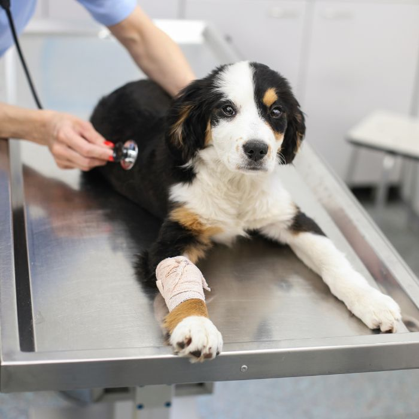
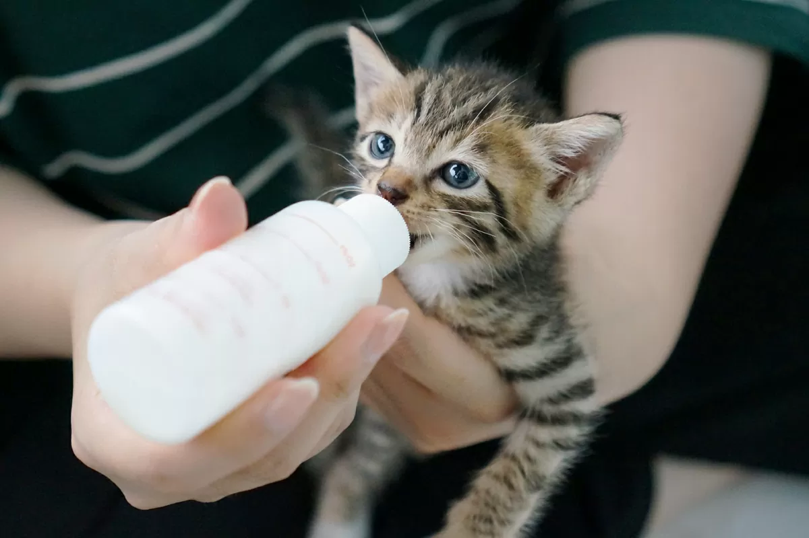

```{r, include = FALSE}
source("data_cleaning.R")
```

<div style="text-align:center;">
  
</div>

<div style="text-align:center; font-size:12px; color:#666;">
  Image Credits: Pine Woods Animal Hospital
</div>

We would like to explore how response duration, which we define as the duration between the initial request and the time that Rangers arrived at the site (`date_and_time_of_ranger_response - date_and_time_of_initial_call`), is associated with different incident characteristics.

--- 

## Average Response Duration by Time of Initial Request
```{r}
ranger_response_hr = park_ranger_new %>% 
  mutate(day_diff = as.numeric(difftime(response_date, call_date, units = "days")),
         time_diff_hrs = as.numeric(difftime(response_time, call_time, units = "hours")),
         response_hrs = time_diff_hrs + 24 * day_diff,
         call_hour = hour(call_time))

ranger_response_hr %>% 
  group_by(call_hour) %>%
  summarise(mean_duration = mean(response_hrs, na.rm = TRUE)) %>% 
  ggplot(aes(x = call_hour, y = mean_duration)) +
  geom_point(color = "skyblue3") +
  geom_line(linewidth = 0.8, color = "skyblue3") + 
  scale_x_continuous(breaks = 0:23) +
  labs(
    title = "Average Response Duration by Time of Initial Request",
    x = "Hour of Day (24-hour)",
    y = "Average Response Hours") +
  theme_minimal()
```

This line plot visualizes variation in response duration across the 24-hour day. 

- Cases reported during regular daytime hours (approximately 8:00 - 16:00) have the shortest response duration, typically around 2-4 hours from the time of initial request to the arrival of a Ranger. This pattern suggests that Ranger availability and operational capacity are highest during standard working hours.

- Response duration keeps increasing in the late afternoon and early evening (17:00-22:00), reaching an extended period of long delays in responses, with average response duration approaching 15 hours. This rise likely reflects reduced staffing after 5 PM, and the possibility that non-urgent incidents are deferred until the working hours the next day. 

- Cases reported late at night and in the early morning (approximately 20:00-5:00) also show longer response durations, often exceeding 10 hours, consistent with limited overnight staffing or slower processing of after-hours calls.

- One notable irregularity is the sharp drop in average response duration around 23:00, followed by a spike at 0:00. This pattern may indicate hour misclassification, where some late-night incidents might be miscoded as 0:00, combined with small sample sizes or boundary effects at the end of the day. These potential misclassifications should be considered and interpreted with cautions.

---

## Distribution of Response Duration
```{r, fig.width=14, fig.height=14}
resp_dur_dist = ranger_response_hr %>% 
  mutate(resp_bin = case_when(
    response_hrs < 1 ~ "0-1 hours", 
    response_hrs >= 1 & response_hrs < 4 ~ "1-4 hours",
    response_hrs >= 4 & response_hrs < 24 ~ "4-24 hours",
    response_hrs >= 24 ~ ">24 hours"),
    resp_bin = factor(resp_bin, levels = c("0-1 hours", "1-4 hours", "4-24 hours", ">24 hours"))
  )

resp_dur_dist_plot = function(df, title_suffix) {
  ggplot(df, aes(x = reorder(animal_condition, response_hrs, FUN = median),
                 y = response_hrs)) +
    geom_violin(trim = FALSE, fill = "skyblue", alpha = 0.5) +
    geom_boxplot(width = 0.3, alpha = 0.8) +
    labs(title = title_suffix,
         x = "Animal Condition", y = "Response Duration (hours)") +
    theme_minimal() +
    theme(
      plot.title = element_text(size = 18, face = "bold"),
      axis.title = element_text(size = 14),
      axis.text  = element_text(size = 12),
      axis.text.x = element_text(angle = 45, hjust = 1, size = 12)
    )
  }

p1 = resp_dur_dist %>% 
  filter(resp_bin == "0-1 hours") %>% 
  resp_dur_dist_plot("0–1 hours")

p2 = resp_dur_dist %>% 
  filter(resp_bin == "1-4 hours") %>% 
  resp_dur_dist_plot("1–4 hours")

p3 = resp_dur_dist %>% 
  filter(resp_bin == "4-24 hours") %>% 
  resp_dur_dist_plot("4–24 hours")

p4 = resp_dur_dist %>% 
  filter(resp_bin == ">24 hours") %>% 
  resp_dur_dist_plot(">24 hours")

(p1 | p2) / (p3 | p4) + plot_annotation(title ="Distribution of Response Duration") &
  theme(text = element_text(size = 24))
```

Because response durations are highly right-skewed, the data were divided more finely at the lower end (0–1 and 1–4 hours), where most observations occur, and grouped into broader segments for longer delays (4–24 and >24 hours).

Across the four panels, response duration does not differ substantially by animal condition. All five groups (Healthy, Unhealthy, Injured, DOA, and Unknown) show largely overlapping distributions with similar central tendencies.

- DOA cases tend to have longer response times than other groups in all segments except the 0-1 hour range. This suggests that once delays extend beyond the first hour, DOA calls, despite their apparent urgency, are often handled later than other conditions.

- In contrast, healthy animals generally show shorter response times than the other groups within the 0-1, 1-4, and 4-24 hour ranges, indicating relatively quicker handling; only in the >24-hour range do healthy cases show substantial delays. 

- Unhealthy, injured, and unknown animals show broader variability, and none of these categories show a consistent pattern of being responded to earlier or later.

These patterns suggest that while condition categories provide some descriptive context, they do not strongly influence response priority. The variability within each condition is greater than any differences between conditions. Long right-tail delays appear across all groups, especially in the >24-hour range, indicating that extremely slow responses occur regardless of the reported condition.

Overall, the figure indicates that the reported animal condition plays only a minimal role. 

---

## Density of Ranger Response Duration by Borough
```{r, warning = FALSE}
ranger_model = ranger_response_hr %>%
  mutate(
    call_hour_cat = case_when(call_hour >= 0 & call_hour < 8 ~ "0-8",
                              call_hour >= 8 & call_hour < 16 ~ "8-16",
                              call_hour >= 16 & call_hour < 24 ~ "16-24"),
    call_hour_cat = factor(call_hour_cat, levels = c("8-16", "0-8", "16-24"))
  ) %>% 
  select(response_hrs, borough, call_source, species_status, animal_condition, 
         adult, juvenile, infant, animal_class_new, number_of_animals, call_hour_cat) %>% 
  na.omit()

ranger_model %>% 
  ggplot(aes(x = log(response_hrs), color = borough)) +
  geom_density() +
  labs(title = "Density of Ranger Response Duration by Borough",
       x = "Response Duration (hours)",
       y = "Density",
       color = "Borough") +
  theme_minimal()
```

Because the response-duration distribution is highly right-skewed, with a long tail extending to several hundred hours, we applied a natural log transformation to stabilize the variance and make differences across boroughs more interpretable.

Across boroughs, the density curves show only small differences in response duration. All boroughs have an average of `log(response duration)` less than 0, which means the average of response duration is less than 1 hour, showing fast response duration on average. 

- Manhattan and Brooklyn have slightly right-shifted peaks on the log scale, indicating somewhat slower responses on average compared to others. This might be because these boroughs tend to have higher call volume and more complex environment, which can slow down dispatch and travel time. Manhattan’s dense urban setting and Brooklyn’s large geographic area may also contribute to longer navigation times and resource constraints relative to the other boroughs.

- Queens, the Bronx, and Staten Island have slightly left-shifted peaks on the log scale, indicating somewhat faster responses on average. Operationally, these boroughs may experience less congestion and fewer competing requests, contributing to slightly shorter response duration.

Despite these minor shifts in central tendency, the overall shapes of the distributions are highly similar. Within-borough variation is much greater than between-borough variation.

---

## Multiple Linear Regression
When examining animal condition and borough individually in the raw distributions, neither appears to be a strong or consistent determinant of response duration. These unadjusted patterns suggest that other confounding factors (e.g., call timing, call source) may play a larger role. To evaluate these effects while holding other variables constant, we fit a multiple linear regression model that incorporates incident characteristics including borough, call source, species status, animal condition, age category, animal class, number of animals, and call time.

```{r}
model = lm(response_hrs ~ borough + call_source + species_status + animal_condition + 
             adult + juvenile + infant + animal_class_new + number_of_animals + 
             call_hour_cat, data = ranger_model)

summary(model)$coefficients %>%
  as.data.frame() %>%
  tibble::rownames_to_column("Variable") %>%
  dplyr::rename(
    Estimate   = Estimate,
    Std_Error  = `Std. Error`,
    t_value    = `t value`,
    p_value    = `Pr(>|t|)`
  ) %>% 
  mutate(
    p_value = format.pval(p_value, digits = 2, eps = 2e-16)
  ) %>% 
  knitr::kable("html", digits = 4, 
               caption = "Regression Coefficient Table", align = c("l", "r", "r", "r", "r")) %>% 
  kableExtra::kable_styling(full_width = FALSE) %>%
  kableExtra::column_spec(1, width = "25em") %>%
  kableExtra::column_spec(2:5, width = "6em")
```

We use a multiple linear regression model to estimate the independent contribution of each predictor to response duration, allowing us to isolate the effect of each variable while holding other factors constant.

After adjustment, several predictors show meaningful statistical associations:

**Call time of day** (reference = 8:00-16:00)

- Overnight incidents (0:00–8:00) take about 7.5 hours longer to receive a response, which is one of the strongest effects in the model.

- Evening incidents (16:00–24:00) also experience significantly slower responses, with delays of nearly 4 hours compared to daytime.

- Overall, daytime remains the period with the fastest and most efficient ranger responses. 

- These patterns suggest a progressive decline in responsiveness after normal working hours, likely reflecting reduced staffing and slower processing outside regular working shifts.

**Call source** (reference = Public)

- Incidents reported from Central Dispatch, conservancies, employees, and rangers tend to receive responses that are 1.7–2.2 hours faster than public reports, with the Central Dispatch and employee categories showing statistically significant effects. This suggests that internal reporting channels, which are more direct and reliable, are easier to prioritize, whereas public reports can vary widely in urgency and clarity, potentially slowing response duration.

- Reports categorized as "Other" tend to be slower than public calls, indicating greater variability in information quality or urgency.

- Categories with very small sample sizes (such as WINORR [Wildlife In Need of Rescue and Rehabilitation] or WBF [Wildlife Ball Field]) display large estimated effects but also uncertainty, so these results should be interpreted cautiously.

**Species status** (reference = Native)

- Incidents involving exotic species require significantly more response duration, with responses roughly 7 hours slower than those involving native species. This delay may reflect additional safety assessments, limited availability of specialized handlers, or the need for species identification before dispatch.

- Other species-status categories show little or no meaningful differences in response duration compared to native species.

**Animal class** (reference = Birds / Raptors)

- Reptile or amphibian cases are handled about 3 hours faster than birds or raptors, which represents a clear and consistent pattern, suggesting these cases require less pre-arrival preparation, whereas birds/raptors may require nets, protective gear, or specialized carriers.

- Fish-related incidents tend to be much slower, but this pattern is unstable due to very small sample size.

- Other animal classes show minor or uncertain differences relative to birds or raptors.

**Borough effects** (reference = Manhattan)

- After adjusting for call characteristics and operational factors, the borough effects differ from the raw patterns observed earlier.

- Compared with Manhattan, both Brooklyn and the Bronx show meaningfully faster response duration (about 1.7–1.8 hours shorter) - although difference between the Bronx and Manhattan is only borderline significant. A possible explanation is that these boroughs may have more concentrated ranger coverage and experience less congestion, allowing for faster travel times.

- In contrast, Staten Island, despite being geographically smaller and less densely populated, shows a possible tendency toward slower responses, but the estimate is not statistically significant. This pattern likely reflects limited ranger staffing, longer travel distances between regions, and the need to cross bridges, which can offset the potential advantages of a smaller service area.

- Queens differs very little from Manhattan, with only a small and negligible difference in response duration

- Overall, borough effects seem to be driven by a combination of coverage density, traffic patterns, and logistical constraints rather than size alone.

In contrast, the following variables do not show meaningful associations with response duration when controlling for other factors:

**Animal Condition** (reference = Healthy)

- Dead-on-arrival cases tend to be handled about 1.5 hours faster, likely because they require fewer preparation, though this difference is not statistically significant.

- Cases involving injured, unhealthy, or unknown animal conditions show small and inconsistent differences compared with healthy animals.

**Age** (Adult, Juvenile, Infant)

- Although the estimated coefficients are relatively large, the effects are not statistically meaningful and do not indicate a real influence on response duration

- These effects likely reflect case-specific variability rather than systematic prioritization.

**Number of Animals**

- The number of animals involved has no meaningful impact on response duration. 

Taken together, these results suggest that operational factors-such as when, where, and through which channel an incident is reported-explain most of the observed differences in response duration. Biological characteristics of the animals, with the exception of exotic species, play a comparatively smaller role. 

---

## Coefficient Plot
```{r}
broom::tidy(model, conf.int = TRUE) %>% 
  ggplot(aes(x = reorder(term, estimate), y = estimate)) +
  geom_pointrange(aes(ymin = conf.low, ymax = conf.high)) +
  geom_hline(yintercept = 0, linetype = "dashed", color = "red") +
  coord_flip() +
  labs(title = "Predictor Effects on Response Duration",
       x = "Predictor Variables",
       y = "Estimated Coefficient (hours)") +
  theme_minimal()
```

This coefficient plot highlights the same general patterns seen in the regression table:

- Time of day, call source, exotic species, and several animal classes stand out with clearer effects, whereas most predictors lie near zero or have confidence intervals crossing zero, indicating little or no meaningful association.

---

## Elastic Net Model

Elastic Net was used as a complementary approach to assess variable stability and identify predictors with more consistent signals beyond the Ordinary Least Squares (OLS) estimates.

```{r}
X = model.matrix(~ borough + call_source + species_status + animal_condition + 
                   adult + juvenile + infant + animal_class_new + number_of_animals + 
                   call_hour_cat, data = ranger_model)[, -1]
y = ranger_model$response_hrs

set.seed(123)
fit_cv = cv.glmnet(X, y, alpha = 0.5)

coef(fit_cv, s = "lambda.min") %>% 
  as.matrix() %>% 
  as.data.frame() %>% 
  rownames_to_column(var = "Variable") %>% 
  rename(Coefficient = 2) %>% 
  filter(Coefficient != 0) %>% 
  knitr::kable(
    caption = "Elastic Net Coefficients at lambda_min (0.1811)",
    digits = 4,
    align = "l")
```

Compared with the original linear model, the Elastic Net model resulted in a more simplified set of predictors. Several variables that had non-zero coefficients under OLS were reduced to zero, such as `boroughQueens`, `call_sourceWBF`, `call_sourceWINORR`, `species_statusDomestic`, `species_statusUnknown`, `animal_conditionUnknown`, `juvenile` and `infant` age indicators, and `number_of_animals`. This suggests that these variables do not provide stable or meaningful predictive contribution once penalization is applied.

Among the variables that remained, all effects continued to move in the same direction as in the OLS model. The strongest and most consistent patterns also remained largely unchanged: overnight and evening reports still show longer response duration compared with daytime reports. In addition, internal call sources (e.g., Central Dispatch, employees, rangers) continue to be associated with faster responses than public reports. Exotic species consistently require much longer response duration than native species. Certain animal classes, especially reptiles/amphibians (faster) and fish (slower), also retain relatively large effects even after shrinkage.

Several predictors that originally appeared moderately influential in the OLS model, such as the `adult` age indicator, `animal_class_newMarine Mammals`, and `animal_class_newFish`, showed noticeable reductions in magnitude under Elastic Net.  Although the direction of these effects remained the same, their shrinkage suggests that the larger OLS estimates were likely inflated by noise or multicollinearity rather than reflecting a stable underlying effect.

The remaining predictors still show only small or negligible effects in the Elastic Net model, indicating that their contribution to response duration is minimal once penalization removes unstable signals.

Because Elastic Net does not provide p-values or standard errors, these coefficients should be interpreted as indicators of relative importance rather than formal statistical significance.

<br>
<div style="text-align:center;">
  
</div>

<div style="text-align:center; font-size:12px; color:#666;">
  Image Credits: Getty Images / richgreentea
</div>

Overall, response duration appears to be driven primarily by operational characteristics, most notably call timing and call source, rather than biological or borough-specific features. Adjusted modeling reveals patterns not visible in the raw data, highlighting the importance of accounting for confounding factors when interpreting response-time differences.

