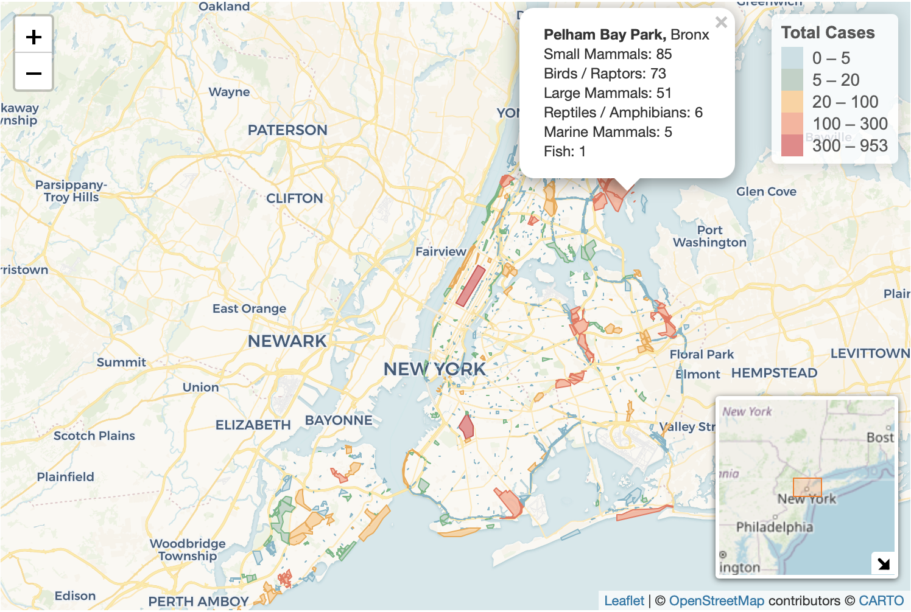

```{r, message = FALSE}
library(tidyverse)
library(hms)
library(lubridate)
library(viridis)
library(ggthemes)
library(scales)
library(glmnet)
library(patchwork)
library(knitr)
library(fuzzyjoin)
library(knitr)
library(base64enc)
library(leaflet)
library(sf)

source("data_cleaning.R") 
```

# Tiny Paws, Big Rescue: 
# A Data Story of Seasonal and Spatial Animal Saving

---

## Motivation

During the 2025 NYC Tree Count, one of our team members observed a raccoon hiding inside a tree cavity in Morningside Park. Park rangers noted that animals living in urban parks are often stressed or displaced by human activity, yet these encounters also give citizens opportunities to notice injuries, abnormal behavior, or animals in distress. These experiences highlight the importance of citizen science in helping residents recognize that cities serve as shared habitats for both humans and wildlife, and in encouraging community involvement in reporting and supporting animals that may need assistance.

Animals play an essential role in maintaining ecological balance, yet those living in dense urban environments like New York City face unique challenges, including traffic, pollution, habitat fragmentation, and frequent interactions with humans. By analyzing the Urban Park Ranger Animal Response dataset, we aim to identify when and where animals most frequently require help, ultimately raising public awareness and supporting timely rescue and conservation efforts.

To achieve this, we are developing an interactive, data-driven website that allows visitors to explore animal rescue patterns through a variety of visualizations. For instance, the site includes interactive maps that display the geographic locations of animal aid incidents, enabling users to identify high-risk areas and examine the number of reported cases in parks of interest. By showing where different animal species are typically found, when incidents occur most frequently, and how park rangers respond, our platform aims to connect the public with the city’s urban wildlife and promote informed, community-supported conservation.

---

## Related Work

Our project is inspired by a range of citizen science and urban ecology initiatives that highlight how collaboration between the public and park agencies can improve wildlife protection in cities. For example, large-scale volunteer programs such as the NYC Tree Census (led by NYC Parks and NYC TreesCount!) demonstrate how citizen science can successfully mobilize thousands of residents to monitor environmental conditions across the city. Similar community-based wildlife monitoring efforts, such as iNaturalist, eBird, and the Urban Wildlife Information Network (UWIN), show that public participation can generate high-quality ecological data and increase awareness of human–wildlife interactions.

---

## Initial Questions

We originally planned to analyze the associations between animal conditions, locations, and time, both across the year and throughout the day. Additional analyses will examine factors that may influence response time, such as park location, animal condition or number, and temporal variables like time of day or frequency within a week or month. Examples of visualizations include a heatmap illustrating the density of injured animals by month and time of day, as well as violin plots grouped by boroughs to show the distribution of response times across regions. We will also conduct statistical tests, such as ANOVA, to evaluate relationships among variables, including borough, response time, animal condition, and time factors.

---

## Data

### Data Source

Our primary dataset is provided by the Department of Parks and Recreation (DPR) and is made publicly available through the NYC OpenData portal [(Urban Park Ranger Animal Condition Response)](https://data.cityofnewyork.us/Environment/Urban-Park-Ranger-Animal-Condition-Response/fuhs-xmg2/about_data). This dataset contains 6,385 records of animal rescue requests from May 2018 to June 2024, including detailed information such as the date and time of each call, ranger response time, park name, specific location descriptions, animal species, and the condition of the animals involved.

One essential component of the website visualization is displaying the number of total cases reported to park rangers for each park. The Park Ranger dataset does not contain geographic coordinates, but it provides the park name or the location associated with each case. To map these cases spatially, we used the [Parks Properties](https://data.cityofnewyork.us/Recreation/Parks-Properties/enfh-gkve/about_data) dataset released by the Department of Parks and Recreation (DPR) on NYC OpenData. This dataset contains 2,054 parks and corresponding geographic coordinates in New York City across five boroughs. Coordinates of the 5 boroughs are from the [Borough Boundaries](https://data.cityofnewyork.us/City-Government/Borough-Boundaries/gthc-hcne/about_data) dataset released by the Department of City Planning (DCP) on NYC OpenData.

### Data Cleaning Process

- Split date and time

- Remove incorrect records based on call & response time

- Rename variable `duration_of_response` to `duration_of_action`

- Reclassify animal classes into 7 categories: Birds / Raptors, Small Mammals, Large Mammals, Marine Mammals, Reptiles / Amphibians, Fish, Others

- Factor categorical variables & set reference level

```{r, message = FALSE}
park_ranger = read_csv("data/Urban_Park_Ranger_Animal_Condition_Response_20251103.csv") %>% 
  janitor::clean_names() %>% 
  mutate(
    date_and_time_of_initial_call = mdy_hm(date_and_time_of_initial_call),
    date_and_time_of_ranger_response = mdy_hm(date_and_time_of_ranger_response),
    
    call_date = as.Date(date_and_time_of_initial_call),
    call_time = as_hms(date_and_time_of_initial_call),
    response_date = as.Date(date_and_time_of_ranger_response),
    response_time = as_hms(date_and_time_of_ranger_response)
  ) %>% 
  filter(date_and_time_of_ranger_response >= date_and_time_of_initial_call) %>% 
  rename(duration_of_action = duration_of_response)

park_ranger_new = park_ranger %>% 
  mutate(
    animal_class_new = case_when(
      animal_class %in% c(
        "[\"Birds\"]", "[\"Raptors\"]", "Birds", "Raptors", 
        "Raptors, Small Mammals-RVS"
      ) ~ "Birds / Raptors",
            
      animal_class %in% c(
        "[\"Small Mammals-non RVS\"]", "[\"Small Mammals-RVS\"]",
        "Small Mammals-non RVS", "Small Mammals-RVS"
      ) ~ "Small Mammals",
      
      animal_class %in% c(
        "Coyotes", "Deer", "[\"Coyotes\"]", "[\"Deer\"]"
      ) ~ "Large Mammals",

      animal_class %in% c(
        "[\"Marine Mammals-whales, Dolphin\"]", "[\"Marine Mammals-seals only\"]",
        "Marine Mammals-seals only", "Marine Mammals-whales,  Dolphin", 
        "Marine Mammals-whales, Dolphin"
      ) ~ "Marine Mammals",
            
      animal_class %in% c(
        "[\"Fish-numerous quantity\"]", "[\"Non Native Fish-(invasive)\"]", 
        "Fish-numerous quantity", "Fish-numerous quantity;#Terrestrial Reptile or Amphibian", 
        "Non Native Fish-(invasive)"
      ) ~ "Fish",
      
      animal_class %in% c(
        "[\"Marine Reptiles\"]", "[\"Terrestrial Reptile or Amphibian\"]", 
        "Marine Reptiles", "Terrestrial Reptile or Amphibian", 
        "Terrestrial Reptile or Amphibian, Fish-numerous quantity"
      ) ~ "Reptiles / Amphibians",

      animal_class %in% c(
        "[\"Rare, Endangered, Dangerous\"]", "Rare,  Endangered,  Dangerous",
        "Rare, Endangered, Dangerous"
      ) ~ "Others",
      
      species_description %in% c(
        "Atlantic Canary","Bird (Unknown)","Budgerigar","Budgerigar Parakeet",
        "Chicken","Chukar","Cockatiel","Domestic Dove","Domestic Duck", "Domestic duck",
        "Domestic Goose","Domestic Goose Hybrid","Domestic Quail","Domestic Turkey",
        "Domestic Waterfowl","Fancy Dove","Guinea Fowl","Guineafowl","Japanese Quail",
        "Khaki Campbell","Muscovy Duck","Rock Dove",
        "Parakeet (Unknown)"
      ) ~ "Birds / Raptors",
      
      species_description %in% c(
        "Domestic Rabbit","Domestic Ferret","Fancy Rat","Gerbil",
        "Guinea Pig", "Guniea Pig", "Guinea pig", "Hamster"
      ) ~ "Small Mammals",
      
      species_description %in% c(
        "Dog","Pitt Bull Mix","Cat","Goat","Cattle","Pig"
      ) ~ "Large Mammals",
      
      species_description %in% c(
        "Animal (Unknown)","Honey Bee", "Unknown","N/A"
      ) ~ "Others"),
    
    animal_class_new = factor(animal_class_new, 
                              levels = c("Birds / Raptors", "Small Mammals", "Large Mammals", 
                                         "Marine Mammals", "Reptiles / Amphibians", "Fish", "Others")),
    
    borough = factor(borough, levels = c("Manhattan", "Brooklyn", "Queens", "Bronx", "Staten Island")),
    
    call_source = factor(call_source, levels = c("Public", "Central", "Employee", 
                                                 "Conservancies/\"Friends of\" Groups", 
                                                 "Observed by Ranger", "WBF", "WINORR", "Other")),
    
    species_status = ifelse(species_status == "N/A" | is.na(species_status), 
                            "Unknown", species_status),
    species_status = factor(species_status, levels = c("Native", "Invasive", "Domestic", 
                                                       "Exotic", "Unknown")),
    
    animal_condition = ifelse(animal_condition == "N/A" | is.na(animal_condition), 
                              "Unknown", animal_condition),
    animal_condition = factor(animal_condition, levels = c("Healthy", "Unhealthy", "Injured", 
                                                           "DOA", "Unknown")),
    
    adult   = if_else(str_detect(age, "Adult"), 1L, 0L, missing = 0L),
    juvenile = if_else(str_detect(age, "Juvenile"), 1L, 0L, missing = 0L),
    infant  = if_else(str_detect(age, "Infant"), 1L, 0L, missing = 0L)
  )
```

### Matching Process for Park Properties

After comparing the **Park Ranger** and **Parks Properties** datasets, we found that many park names in Park Ranger (*property*) did not match the official park names (*signname*) in Parks Properties Specifically, 208 out of 703 unique *property* values had no exact match in *signname*. To recover as many matches as possible, we applied the Jaro–Winkler algorithm from the fuzzyjoin package to perform inexact matching on all unique park names.

We selected Jaro–Winkler algorithm because it is designed for short strings such as names, and it places higher weight on common prefixes, which is useful for matching park names that share the same beginning but differ due to abbreviations, typos, or partial truncation (e.g., “Prospect Pk” vs. “Prospect Park”). 

All fuzzy-matched pairs with similarity scores less than 1 were then manually reviewed by three members of the group, and each match was checked independently by two reviewers to ensure accuracy and inter-rater reliability. After this process, 35 unique property values remained unmatched, typically because they referred to street names (e.g., “Green Street”), or parks that exist but are not included in the Parks Properties dataset (e.g., “Mannahatta Park”). The final map includes 6,118 reported cases across 546 unique parks. Using Jaro–Winkler with a maximum distance threshold of 0.25 resulted in an overall matching accuracy of 43.75% among the 208 originally unmatched values.

```{r, message = FALSE}
# Match park names with Park Properties names
# 1. Import parks properties dataset
park_prop_df = read_csv("data/Parks_Properties_20251107.csv") |> 
  janitor::clean_names()

# 2. Get park names from both datasets
park_name_park_ranger = park_ranger_new |>
  transmute(name_park_ranger = str_to_lower(str_trim(property))) |>
  distinct() |>
  arrange(name_park_ranger)

park_name_park_prop = park_prop_df |>
  transmute(name_park_prop = str_to_lower(str_trim(signname))) |>
  distinct() |>
  arrange(name_park_prop)

# 3. Join datasets on inexact matching, left join on ranger data
# 4. Use Jaro-Winkler algorithm, save pairs with lowest distance (highest similarity)
fuzzy_matches = 
  stringdist_join(
    park_name_park_ranger, park_name_park_prop,
    by = c("name_park_ranger" = "name_park_prop"),
    mode = "left",
    method = "jw", max_dist = 0.25,
    distance_col = "distance") |> 
  group_by(name_park_ranger) |>
  slice_min(distance, n = 1, with_ties = FALSE) |>
  ungroup() |>
  mutate(
    similarity = 1 - distance,
    original_park = name_park_ranger,
    matched_park = name_park_prop) |> 
  select(original_park, matched_park, similarity) |> 
  arrange(original_park)

# 5. Output as a .csv file for manual matching 
write.csv(fuzzy_matches, "data/fuzzy_park_match.csv", row.names = FALSE)

# Create a new dataframe for mapping
# 1. Import dataset with final matched park names, get all animal classes
park_match_df = read_csv("data/park_match_final.csv") |> 
  janitor::clean_names() |> 
  transmute(
    original_park = str_to_lower(str_trim(original_park)),
    final_match = str_to_lower(str_trim(final_match)))

animal_classes = c(
  "Birds / Raptors", 
  "Small Mammals", 
  "Large Mammals",
  "Marine Mammals", 
  "Reptiles / Amphibians",
  "Fish", 
  "Others")

# 2. Join the matched name to park_ranger_new, remove those don't have a matched park
map_park = park_ranger_new |> 
  select(property, animal_class_new) |> 
  mutate(property = str_to_lower(str_trim(property))) |> 
  left_join(park_match_df,
            by = c("property" = "original_park")) |> 
  select(final_match, animal_class_new) |> 
  filter(!final_match %in% c("na"))

# 3. Maintain the order of parks for efficient map rendering 
# 4. Keep those with largest acres if there are more than one parks have the same name
# 5. Join map_park to park property with row expansions, remove parks with no cases
map_park = park_prop_df |> 
  select(borough, signname, multipolygon, acres) |> 
  mutate(
    order = row_number(),
    name_park_prop = str_to_lower(str_trim(signname)),
    acres = as.numeric(acres)) |> 
  group_by(name_park_prop) |> 
  slice_max(order_by = acres, n = 1) |> 
  ungroup() |> 
  select(!acres) |> 
  left_join(map_park,
            by = c("name_park_prop" = "final_match")) |> 
  filter(!is.na(animal_class_new)) 

# 6. Get the number of cases for each animal class in each park
# 7. Keep one row for each park and arrange the df based on original mapping order
# 8. Change borough name to its full name
# 9. Get total number of cases for each park
map_park = map_park |> 
  group_by(name_park_prop, animal_class_new) |> 
  summarize(n = n(), .groups = "drop") |> 
  pivot_wider(
    names_from = animal_class_new,
    values_from = n) |> 
  left_join(map_park |> select(!animal_class_new),
            by = c("name_park_prop" = "name_park_prop")) |> 
  distinct(name_park_prop, .keep_all = TRUE) |> 
  arrange(order) |> 
  mutate(
    borough = case_match(borough,
                         "M" ~ "Manhattan",
                         "B" ~ "Brooklyn",
                         "R" ~ "Staten Island",
                         "Q" ~ "Queens",
                         "X" ~ "Bronx"),
    total_n = rowSums(across(all_of(animal_classes)), na.rm = TRUE))
```

### Cleaned Dataset

The cleaned data includes the following variables:

`date_and_time_of_initial_call`: The date and time of the initial request for animal rescue

`date_and_time_of_ranger_response`: The date and time when the Ranger arrived at the site

`borough`: Borough in which request for assistance was (Manhattan, Brooklyn, Queens, Bronx, Staten Island)

`property`: Name of location of rescue

`location`: Specific cross street of location of rescue

`species_description`: The species being rescued

`call_source`: Location of initial call

`species_status`: The species status (Native, Invasive, Domestic, Exotic, Unknown)

`animal_condition`: The status of the animal reported by initial request

`duration_of_action`: A numerical value representing the amount of time spent responding upon arrival

`age`: The original age column that contains age of each animal

`animal_class`: The original column describing type of species of animal

`x311sr_number`: Service request number generated by the 311 system

`final_ranger_action`: Final action outcome of responding Ranger

`number_of_animals`: A numerical value representing the number of animals attended to

`pep_response`: An indicator variable representing if Parks Enforcement Patrol was called

`animal_monitored`: An indicator variable representing if the animal was monitored during visit

`rehabilitator`: Name of a rehabilitator if animal was taken to one

`hours_spent_monitoring`: Indicates how many hours were spent monitoring the animal

`police_response`: An indicator variable representing if Police were called

`esu_response`: An indicator variable representing if ESU were called

`acc_intake_number`: Reference number if the animal was sent to ACC

`call_date`: Date of the initial request for animal rescue

`call_time`: Time of the initial request for animal rescue

`response_date`: Date when the Ranger arrived at the site

`response_time`: Time when the Ranger arrived at the site

`animal_class_new`: Reclassification of `animal_class` into 7 categories (Birds / Raptors, Small Mammals, Large Mammals, Marine Mammals, Reptiles / Amphibians, Fish, Others)

`adult`, `juvenile`, `infant`: An indicator variable representing the age of the animal being rescued

---

## Exploratory Analysis

### Spatial Pattern

```{r}
# for each row, create the popup content including borough and number of cases (>0) for each animal class
# convert WKT multipolygon strings into sf multipolygon geometry for mapping
map_park_sf = map_park |>
  rowwise() |>
  mutate(
    animal_text = {
      case_num = c_across(all_of(animal_classes))
      case_num_index = !is.na(case_num)
      case_num_order = order(case_num[case_num_index], decreasing = TRUE)
      paste0(
        animal_classes[case_num_index][case_num_order], ": ",
        case_num[case_num_index][case_num_order],
        collapse = "<br>")},
    popup_content = paste0(
      "<b>", signname, ", </b>",
      borough, "<br>",
      animal_text)) |>
  ungroup() |> 
  st_as_sf(wkt = "multipolygon", crs = 4326)

# create a function to create color based on the total number of case reported
density_color = colorBin(
  palette = c("#c9e0e5", "#bed2c6", "#ffd19d", "#feb29b", "#ed8687"),
  bins = c(0, 5, 20, 100, 300, max(map_park$total_n)),
  domain = map_park$total_n
)

border_color = colorBin(
  palette = c("#7db7c8", "#6ab883", "#f2a84a", "#f0735b", "#d44c4e"),
  bins = c(0, 5, 20, 100, 300, max(map_park$total_n)),
  domain = map_park$total_n
)

# map with leaflet
# use CartoDB.Voyager tile layer
# fill in color using density_color based on total_n
# add a minimap
interactive_map_park = leaflet(map_park_sf, height = 500) |> 
  addProviderTiles("CartoDB.Voyager") |>
  addPolygons(
    color = ~border_color(total_n),
    weight = 1,
    opacity = 2,
    fillColor = ~density_color(total_n),
    fillOpacity = 0.9,
    popup = ~popup_content
  ) |> 
  addMiniMap(toggleDisplay = TRUE) |> 
  addLegend(
    pal = density_color,
    values = ~total_n,
    title = "Total Cases",
    position = "topright",
    opacity = 1)
```

<div style="text-align:center;">
  
</div>

<div style="text-align:center; font-size:12px; color:#666;">
  Screenshot of the interactive map on Home page
</div>

The map above displays the parks in which animal rescue calls occurred, with darker shading indicating a higher total number of reported cases. Each park is clickable, and the corresponding popup provides a breakdown of case counts by animal class. Overall, parks with darker shading tend to be larger in geographic area and are often located in high-density regions, such as major tourist destinations or busy residential neighborhoods. These patterns suggest that both park size and human activity may contribute to the frequency of reported animal incidents.

**borough 代码**

<div style="text-align:center;">
  
</div>

<div style="text-align:center; font-size:12px; color:#666;">
  Screenshot of the interactive map on Health Condition page
</div>

The map above displays the total number of animal rescue calls from each borough, with darker shading indicating a higher total number of reported cases. Each borough is clickable, and the corresponding popup presents the bar graph of case counts by animal class. Based on the visualization, Manhattan has the highest number of reported cases overall.

**bar plot**

The accompanying bar plot provides a clearer comparison across boroughs. Manhattan has the highest total number of cases, driven largely by small mammals. Manhattan, Queens, and Brooklyn all report particularly high counts for birds/raptors, whereas Staten Island shows the highest numbers for marine mammals, fish, and reptiles/amphibians, and the Bronx reports the highest number of cases involving large mammals.

### Temporal Pattern

This part presents a comprehensive analysis and visualization of temporal patterns in wildlife incident reports, with the goal of generating data-driven insights to optimize rescue response strategies and operational efficiency within urban park systems. Through an in-depth examination of seasonal fluctuations, daily cycles, and categorical trends, it seeks to inform proactive planning, improve resource allocation, and enhance protection efforts for urban wildlife.

#### Monthly Trends Analysis

This analysis examines seasonal patterns in animal rescue cases to identify how different animal categories respond to environmental changes throughout the year. Understanding these temporal patterns helps predict peak demand periods for wildlife services.

```{r, fig.width=9, fig.height=5}
monthly_animal_trends = park_ranger_new |> 
  mutate(
    call_month = month(date_and_time_of_initial_call, label = TRUE, abbr = TRUE)
  ) |> 
  group_by(call_month, animal_class_new) |> 
  summarise(case_count = n(), .groups = "drop") |> 
  # Ensure all months are represented for each animal class
  complete(call_month, animal_class_new, fill = list(case_count = 0))

mon_case_plot = monthly_animal_trends |> 
  ggplot(aes(x = call_month, y = case_count, group = animal_class_new, color = animal_class_new)) +
  geom_line(linewidth = 1.2) +
  geom_point(size = 2) +
  scale_y_continuous(breaks = pretty_breaks()) +
  labs(
    title = "Monthly Animal Response Cases by Animal Class (New Classification)",
    subtitle = "Urban Park Ranger Animal Condition Response",
    x = "Month",
    y = "Number of Cases",
    color = "Animal Class"
  ) +
  theme_minimal() + 
  theme(
    axis.text.x = element_text(angle = 45, hjust = 1),
    legend.position = "bottom",
    plot.title = element_text(face = "bold", size = 14),
    plot.subtitle = element_text(size = 10),
    legend.text = element_text(size = 8),
    panel.background = element_rect(fill = "white", color = NA), 
    plot.background = element_rect(fill = "white", color = NA)
  )  +
  scale_color_viridis_d()

print(mon_case_plot)
```

This line chart displays the monthly distribution of animal response cases across 7 reclassified animal categories throughout the year.

Key Findings:

  * Birds and raptors demonstrate a notable increase in cases beginning in February, reaching a peak in June, and declining to their lowest levels by November, possibly reflecting migratory patterns, nesting seasons, and reduced activity during colder months. 

  * Small mammals exhibit three distinct peaks in case numbers during April, August, and October, which may suggest potential associations with breeding cycles, seasonal resource availability, or periodic human-wildlife interactions in urban environments.

  * Large mammals maintain relatively consistent case numbers between 70 and 80 throughout the year, indicating potentially stable population dynamics or continuous human encounters despite seasonal variations.

   * Reptiles and amphibians show generally low and stable case numbers with a moderate peak around 100 in June, which might be linked to temperature-dependent activity patterns and increased visibility during warmer conditions.

   * Marine mammals and other categories remain consistently minimal with case counts in the single digits, possibly due to their limited presence in urban park ecosystems or lower detection rates.

#### Temporal Distribution Analysis

We use heatmap visualization to reveal how animal rescue cases distribute across both daily hours and monthly periods, identifying optimal response windows and understanding the interplay between human activity cycles and wildlife behavior.

```{r, fig.width=9, fig.height=5.5}
hourly_monthly_heatmap = park_ranger_new |> 
  mutate(
    call_month = month(date_and_time_of_initial_call, label = TRUE, abbr = TRUE),
    call_hour = hour(date_and_time_of_initial_call)
  ) |> 
  filter(!is.na(call_month) & !is.na(call_hour)) |> 
  group_by(call_month, call_hour) |> 
  summarise(case_count = n(), .groups = "drop") |> 
  complete(call_month, call_hour, fill = list(case_count = 0))

max_cases = max(hourly_monthly_heatmap$case_count)
color_breaks = c(0, 1, 5, 10, 20, 50, max_cases)

red_palette = colorRampPalette(c("#FFF5F0", "#FEE0D2", "#FCBBA1", "#FC9272", "#FB6A4A", "#EF3B2C", "#CB181D", "#99000D"))(length(color_breaks))

case_heatmap = hourly_monthly_heatmap |>
  ggplot(aes(x = call_hour, y = call_month, fill = case_count)) +
  geom_tile(color = "white", linewidth = 0.3) +
  scale_fill_gradientn(
    name = "Case Count",
    colors = red_palette,
    values = rescale(color_breaks),
    breaks = color_breaks,
    guide = guide_colorbar(
      barwidth = 30,
      barheight = 0.8,
      direction = "horizontal",
      title.position = "top"
    )
  ) +
  scale_x_continuous(
    breaks = seq(0, 23, by = 2),
    labels = c("12AM", "2AM", "4AM", "6AM", "8AM", "10AM", 
               "12PM", "2PM", "4PM", "6PM", "8PM", "10PM")
  ) +
  labs(
    title = "Animal Response Cases: Detailed Hourly and Monthly Distribution",
    subtitle = "Enhanced color gradient reveals subtle patterns in case distribution",
    x = "Hour of Day",
    y = "Month"
  ) +
  theme_fivethirtyeight() +
  theme(
    axis.text.x = element_text(angle = 45, hjust = 1, size = 8, color = "black"),
    axis.text.y = element_text(size = 9, color = "black"),
    axis.title = element_text(color = "black"),
    plot.title = element_text(face = "bold", size = 14, color = "black"),
    plot.subtitle = element_text(size = 10, color = "#333333"),
    legend.position = "bottom",
    legend.title = element_text(size = 9, color = "black"),
    legend.text = element_text(size = 8, color = "black"), 
    legend.background = element_rect(fill = "white", color = NA),
    panel.background = element_rect(fill = "white", color = NA),
    plot.background = element_rect(fill = "white", color = NA)
  )

plot(case_heatmap)

```

Case distribution primarily concentrates between 8:00 and 18:00, aligning with peak park visitation and diurnal animal activity. Summer exhibits extended evening activity likely due to increased daylight and recreational use, while winter shows contracted midday patterns corresponding to reduced daylight availability. Minimal overnight reporting may reflect limited detection capabilities during low-human-activity periods.

#### Recommendations

Enhanced ranger coverage during summer afternoons could address elevated case frequencies across multiple species. Early spring public education initiatives might mitigate conflicts by raising awareness of seasonal animal behaviors. Rescue organizations should anticipate increased warm-weather intake while utilizing winter for strategic planning. Visitor vigilance during peak seasons and prompt daylight reporting could improve response effectiveness, supplemented by community monitoring programs and coordinated rehabilitation networks.

### Health condition

```{r}
## Data Processing
# health by class
health_by_class =
  park_ranger_new |>
    count(animal_class_new, animal_condition, name = "n")

class_order =
  health_by_class |>
    group_by(animal_class_new) |>
    summarise(total = sum(n), .groups = "drop") |>
    arrange(desc(total)) |>
    pull(animal_class_new)

health_by_class$animal_class_new =
  factor(health_by_class$animal_class_new, levels = class_order)

# health by borough
health_by_borough =
  park_ranger_new |>
    count(borough, animal_condition, name = "n")

borough_order =
  health_by_borough |>
    group_by(borough) |>
    summarise(total = sum(n), .groups = "drop") |>
    arrange(desc(total)) |>
    pull(borough)

health_by_borough$borough =
  factor(health_by_borough$borough, levels = borough_order)

health_by_borough$hover_text =
  paste0(
    "Borough: ", health_by_borough$borough, "<br>",
    "Health Condition: ", health_by_borough$animal_condition, "<br>",
    "Count: ", health_by_borough$n
  )

## Plot
color_palette_1 = c(
  "#f0f9e8",
  "#bae4bc",
  "#7bccc4",
  "#43a2ca",
  "#0868ac"
)

# Plot1: health by class
p1 <- health_by_class |>
  ggplot(aes(x = animal_class_new, y = n, fill = animal_condition)) +
  geom_col() +
  scale_fill_manual(values = color_palette_1, name = "Health Condition") +
  labs(
    x = "Animal Class",
    y = "Number of Cases"
  ) +
  theme_minimal(base_size = 12) +
  theme(
    axis.text.x = element_text(angle = 30, hjust = 1)
  )

# Plot2: health by borough
p2 <- health_by_borough |>
  ggplot(aes(x = borough, y = n, fill = animal_condition)) +
  geom_col() +
  scale_fill_manual(values = color_palette_1, name = "Health Condition") +
  labs(
    x = "Borough",
    y = "Number of Cases"
  ) +
  theme_minimal(base_size = 12) +
  theme(
    axis.text.x = element_text(angle = 30, hjust = 1),
    legend.position = "none"
  )

# Combine
combined_plot <- p1 + p2 +
  plot_layout(ncol = 2, guides = "collect") &
  theme(legend.position = "bottom")

combined_plot + 
  plot_annotation(
    title = "Health Conditions by Animal Class and Borough",
    theme = theme(plot.title = element_text(hjust = 0.5, size = 13, face = "bold"))
  )
```


The distribution of animal health conditions shows clear variation across both animal classes and boroughs. Birds/Raptors and Small Mammals account for most wildlife-related calls, but when health conditions are examined separately, Small Mammals display disproportionately higher numbers of Unhealthy, DOA, and Unknown cases compared with Birds. This suggests that small mammals are often not detected until their condition is severe, whereas birds tend to be reported earlier because they are more visible in open spaces and their abnormal behavior is easier for the public to notice.  

Spatial patterns further highlight differences in how and when animals are found. Manhattan has the highest overall case count, reflecting dense human activity and frequent wildlife encounters, yet its Injured cases are slightly fewer than expected—possibly because animals in Manhattan are noticed and assisted before injuries become severe. Queens shows unusually few Unknown cases, suggesting clearer initial reporting or more consistent condition assessment. Staten Island has more DOA but fewer Unhealthy cases, consistent with an area where wildlife is abundant but human presence is sparse, causing sick animals to go unnoticed until death. In contrast, the Bronx shows somewhat more Healthy cases, possibly due to large park areas where routine, non-emergency wildlife encounters are common.  

Together, these patterns indicate that reported health conditions depend not only on animal behavior and species visibility but also on borough-specific environments, human activity, and differences in how quickly animals are noticed and reported. 


### Response Duration

We would like to explore how response duration, which we define as the duration between the initial request and the time that Rangers arrived at the site (`date_and_time_of_ranger_response - date_and_time_of_initial_call`), is associated with different incident characteristics.

#### Average Response Duration by Time of Initial Request

```{r}
ranger_response_hr = park_ranger_new %>% 
  mutate(day_diff = as.numeric(difftime(response_date, call_date, units = "days")),
         time_diff_hrs = as.numeric(difftime(response_time, call_time, units = "hours")),
         response_hrs = time_diff_hrs + 24 * day_diff,
         call_hour = hour(call_time))

ranger_response_hr %>% 
  group_by(call_hour) %>%
  summarise(mean_duration = mean(response_hrs, na.rm = TRUE)) %>% 
  ggplot(aes(x = call_hour, y = mean_duration)) +
  geom_point(color = "skyblue3") +
  geom_line(linewidth = 0.8, color = "skyblue3") + 
  scale_x_continuous(breaks = 0:23) +
  labs(
    title = "Average Response Duration by Time of Initial Request",
    x = "Hour of Day (24-hour)",
    y = "Average Response Hours") +
  theme_minimal()
```

This line plot visualizes variation in response duration across the 24-hour day. 

- Cases reported during regular daytime hours (approximately 8:00 - 16:00) have the shortest response duration, typically around 2-4 hours from the time of initial request to the arrival of a Ranger. This pattern suggests that Ranger availability and operational capacity are highest during standard working hours.

- Response duration keeps increasing in the late afternoon and early evening (17:00-22:00), reaching an extended period of long delays in responses, with average response duration approaching 15 hours. This rise likely reflects reduced staffing after 5 PM, and the possibility that non-urgent incidents are deferred until the working hours the next day. 

- Cases reported late at night and in the early morning (approximately 20:00-5:00) also show longer response durations, often exceeding 10 hours, consistent with limited overnight staffing or slower processing of after-hours calls.

- One notable irregularity is the sharp drop in average response duration around 23:00, followed by a spike at 0:00. This pattern may indicate hour misclassification, where some late-night incidents might be miscoded as 0:00, combined with small sample sizes or boundary effects at the end of the day. These potential misclassifications should be considered and interpreted with cautions.

#### Distribution of Response Duration

```{r, fig.width=14, fig.height=14}
resp_dur_dist = ranger_response_hr %>% 
  mutate(resp_bin = case_when(
    response_hrs < 1 ~ "0-1 hours", 
    response_hrs >= 1 & response_hrs < 4 ~ "1-4 hours",
    response_hrs >= 4 & response_hrs < 24 ~ "4-24 hours",
    response_hrs >= 24 ~ ">24 hours"),
    resp_bin = factor(resp_bin, levels = c("0-1 hours", "1-4 hours", "4-24 hours", ">24 hours"))
  )

resp_dur_dist_plot = function(df, title_suffix) {
  ggplot(df, aes(x = reorder(animal_condition, response_hrs, FUN = median),
                 y = response_hrs)) +
    geom_violin(trim = FALSE, fill = "skyblue", alpha = 0.5) +
    geom_boxplot(width = 0.3, alpha = 0.8) +
    labs(title = title_suffix,
         x = "Animal Condition", y = "Response Duration (hours)") +
    theme_minimal() +
    theme(
      plot.title = element_text(size = 18, face = "bold"),
      axis.title = element_text(size = 14),
      axis.text  = element_text(size = 12),
      axis.text.x = element_text(angle = 45, hjust = 1, size = 12)
    )
  }

p1 = resp_dur_dist %>% 
  filter(resp_bin == "0-1 hours") %>% 
  resp_dur_dist_plot("0–1 hours")

p2 = resp_dur_dist %>% 
  filter(resp_bin == "1-4 hours") %>% 
  resp_dur_dist_plot("1–4 hours")

p3 = resp_dur_dist %>% 
  filter(resp_bin == "4-24 hours") %>% 
  resp_dur_dist_plot("4–24 hours")

p4 = resp_dur_dist %>% 
  filter(resp_bin == ">24 hours") %>% 
  resp_dur_dist_plot(">24 hours")

(p1 | p2) / (p3 | p4) + plot_annotation(title ="Distribution of Response Duration") &
  theme(text = element_text(size = 24))
```

Because response durations are highly right-skewed, the data were split more at the lower end (0–1 and 1–4 hours) where most observations occur, while broader segments were used for longer delays (4–24 and >24 hours). 

The plots show that response duration does not meaningfully differ across animal condition categories. All five groups (Healthy, Unhealthy, Injured, DOA, and Unknown) display highly overlapping distributions with similar central tendencies. The within-condition variability is much larger than any between-condition differences. The long right tails are present across all categories, especially in the >24 hour panel, suggesting that extremely slow responses occur regardless of the reported condition. 

Overall, the figure indicates that the reported animal condition plays only a minimal role. 

#### Density of Ranger Response Duration by Borough

```{r, warning = FALSE, message = FALSE}
ranger_model = ranger_response_hr %>%
  mutate(
    call_hour_cat = case_when(call_hour >= 0 & call_hour < 8 ~ "0-8",
                              call_hour >= 8 & call_hour < 16 ~ "8-16",
                              call_hour >= 16 & call_hour < 24 ~ "16-24"),
    call_hour_cat = factor(call_hour_cat, levels = c("8-16", "0-8", "16-24"))
  ) %>% 
  select(response_hrs, borough, call_source, species_status, animal_condition, 
         adult, juvenile, infant, animal_class_new, number_of_animals, call_hour_cat) %>% 
  na.omit()

ranger_model %>% 
  ggplot(aes(x = log(response_hrs), color = borough)) +
  geom_density() +
  labs(title = "Density of Ranger Response Duration by Borough",
       x = "Response Duration (hours)",
       y = "Density",
       color = "Borough") +
  theme_minimal()
```

Because the response-duration distribution is highly right-skewed, with a long tail extending to several hundred hours, we applied a natural log transformation to stabilize the variance and make differences across boroughs more interpretable.

Across boroughs, the density curves show only small differences in response duration. All boroughs have an average of `log(response duration)` less than 0, which means the average of response duration is less than 1 hour, showing fast response duration on average. 

- Manhattan and Brooklyn have slightly right-shifted peaks on the log scale, indicating somewhat slower responses on average compared to others. This might be because these boroughs tend to have higher call volume and more complex environment, which can slow down dispatch and travel time. Manhattan’s dense urban setting and Brooklyn’s large geographic area may also contribute to longer navigation times and resource constraints relative to the other boroughs.

- Queens, the Bronx, and Staten Island have slightly left-shifted peaks on the log scale, indicating somewhat faster responses on average. Operationally, these boroughs may experience less congestion and fewer competing requests, contributing to slightly shorter response duration.

Despite these minor shifts in central tendency, the overall shapes of the distributions are highly similar. Within-borough variation is much greater than between-borough variation.

### Final Ranger Action

We examined action duration and final ranger actions to understand how different types of wildlife incidents demand time and effort from Urban Park Rangers. By comparing duration across action types, animal conditions, and action–condition combinations, we can identify which situations require intensive intervention, which are resolved quickly, and where uncertainty or coordination challenges lead to variability. Assessing distribution patterns and statistical differences also helps clarify operational drivers behind long responses and supports more informed planning and resource allocation within the ranger system.

<br>

#### Action Duration by Final Ranger Action

```{r, warning=FALSE}
park_model = park_ranger_new |>
  rename(num_animals = matches("animals")) |>
  mutate(
    duration_hours      = as.numeric(duration_of_action),
    num_animals         = as.numeric(num_animals)
  ) |>
  filter(
    !is.na(duration_hours),
    duration_hours > 0,
    !is.na(final_ranger_action),
    !is.na(animal_condition),
    !is.na(num_animals),
    num_animals >= 0
  )

action_order <- park_model |>
  group_by(final_ranger_action) |>
  summarise(med = median(duration_hours, na.rm = TRUE)) |>
  arrange(med) |>
  pull(final_ranger_action)


park_model_action <- park_model |>
  mutate(final_ranger_action = factor(final_ranger_action, levels = action_order))

ggplot(park_model_action, aes(x = final_ranger_action, y = duration_hours)) +
  geom_violin(trim = FALSE, fill = "#BFCDE0", color = "#5D7CA6",
              alpha = 0.5, scale = "width") +
  geom_boxplot(width = 0.5, fill = "white", outlier.alpha = 0.3) +
  coord_flip() +
  scale_x_discrete(labels = function(x) str_wrap(x, width = 20)) +
  ylim(0, 40) +
  labs(
    title = "Distribution of Action Duration by Final Ranger Action",
    x = "Final Ranger Action (sorted by median duration)",
    y = "Action Duration (hours)"
  ) +
  theme_bw() +
  theme(
    plot.title = element_text(hjust = 0.5),
    axis.text.y = element_text(size = 8)
  )

```

The combined violin–boxplot shows clear differences in action duration across ranger actions. The visualization is capped at 40 hours to enhance focus on the central data distribution, noting that the `ACC` category (Animal Care Center) contains one extreme outlier with a duration exceeding 70 hours that is not displayed.

- Rehabilitation-related actions take the longest.
Categories such as `Released back into Park after Rehabilitation` and `Rehabilitator` have the highest medians and widest spreads, reflecting the need for assessment, coordination with rehabilitators, transport, and extended monitoring.

- Administrative or low-intervention actions are short.
Actions like `Advised/Educated others`, `Submitted for DEC (Department of Environmental Conservation) Testing`, `Relocated/Condition Corrected` and `Monitored Animal` have much shorter, tightly clustered durations, consistent with quick assessments or minor interventions.

- `ACC` and `Unfounded` responses show high variability.
`ACC` transfers sometimes take much longer due to coordination and handling challenges.
`Unfounded` cases are usually brief but occasionally long when searches, misreported calls, or verification require extra time.

- Outliers represent rare long-duration events.
Several actions, especially `ACC`, `Unfounded`, and `Rehabilitator`, include outliers over 30 hours, likely due to long-term monitoring, repeated site visits, or delays in coordinating animal handoffs.

<br>

#### Action Duration by Animal Condition

```{r, warning=FALSE}
park_model_cond <- park_model |>
  mutate(
    animal_condition = fct_reorder(
      animal_condition,
      duration_hours,
      .fun = median,
      na.rm = TRUE
    )
  )

ggplot(park_model_cond, aes(x = animal_condition, y = duration_hours)) +
  geom_violin(trim = FALSE, fill = "#BFCDE0", color = "#5D7CA6",
              alpha = 0.5, scale = "width") +
  geom_boxplot(width = 0.5, fill = "white", outlier.alpha = 0.3) +
  coord_flip() +
   ylim(0, 40) +
  labs(
    title = "Distribution of Action Duration by Animal Condition",
    x = "Animal Condition",
    y = "Action Duration (hours)"
  ) +
  theme_bw() +
  theme(
    plot.title = element_text(hjust = 0.5),
    axis.text.y = element_text(size = 8)
  )
```

The violin–boxplot shows how `action duration` differs across animal conditions. The visualization is capped at 40 hours to enhance focus on the central data distribution, noting that the `Unknown` category contains one extreme outlier with a duration exceeding 70 hours that is not displayed.

- `Unhealthy` and `Injured` animals show substantial variability in `duration time`, with the highest median durations. The wide distribution reflects the need for diverse handling, such as `rehabilitator`, `ACC` and `monitored`.

- `Unknown` conditions show moderate dispersion with a low median. While most cases are resolved quickly, the variability suggests time is occasionally spent on investigation or clarifying the initial report.

- `Healthy` animals exhibit the maximum variability in `action duration`, despite having a low median. This wide spread is likely due to the diverse range of possible actions, such as `relocated`, `ACC` and `monitored`.

- `DOA` (Dead on Arrival) cases consistently require the minimal variability in `action duration`, with the lowest median time. This is expected since most `DOA` cases are `relocated/condition corrected`.

<br>

#### Final Ranger Actions by Animal Condition

```{r}
park_model4 <- park_model |>
  filter(animal_condition %in% c("Healthy", "Unhealthy", "Injured", "DOA"))

plot_condition_bar <- function(data, cond, ymax) {

  df <- data |>
    filter(animal_condition == cond) |>
    count(final_ranger_action) |>
    arrange(n)

  df$final_ranger_action <- factor(df$final_ranger_action,
                                   levels = df$final_ranger_action)

  ggplot(df, aes(x = final_ranger_action, y = n)) +
    geom_col(fill = "#4F81BD", alpha = 0.85) +
    coord_flip() +
    scale_y_continuous(limits = c(0, ymax),
                       expand = expansion(mult = c(0, 0.05))) +
    labs(
      title = cond,
      x = "Final Ranger Action",
      y = "Number of Cases") +
    theme_bw() +
    theme(
      plot.title = element_text(hjust = 0.5),
      axis.text.y = element_text(size = 8))
}
max_cases <- park_model4 |>
  count(animal_condition, final_ranger_action) |>
  pull(n) |>
  max()

p1 <- plot_condition_bar(park_model4, "Healthy",   max_cases)
p2 <- plot_condition_bar(park_model4, "Unhealthy", max_cases)
p3 <- plot_condition_bar(park_model4, "Injured",   max_cases)
p4 <- plot_condition_bar(park_model4, "DOA",       max_cases)

(p1 | p2) /
(p3 | p4) +
  plot_annotation(
    title = 'Final Ranger Actions by Animal Condition', 
    theme = ggplot2::theme(
      plot.title = ggplot2::element_text(
        hjust = 0.5, 
        size = 14
      )
    )
  )
```

The four-panel plot compares `ranger actions` across `animal conditions`.

- `Healthy` animals:
Most cases involve `Relocated/Condition Corrected` or `ACC`, reflecting simple removal from unsafe areas or routine transfer for evaluation. Rehabilitation-related actions are rare because healthy animals seldom require intensive care.

- `Unhealthy` animals:
`ACC` is the dominant response, followed by `Rehabilitator`, consistent with the need for medical assessment or long-term care. Actions like `DEC Testing` or relocation are infrequent, as relocation alone is usually inadequate for visibly unhealthy animals.

- `Injured` animals:
Common actions include `Rehabilitator`, `Unfounded`, and `ACC`. Injured animals often need hands-on treatment, while higher `Unfounded` counts suggest that some animals could not be located or had recovered by the time rangers arrived.

- `DOA` animals:
`Relocated/Condition Corrected` is the most frequent action, as dead animals primarily require removal from public spaces. Occasional `ACC` or `DEC Testing` cases reflect situations requiring identification or documentation before disposal.

<br>

#### Distribution of Action Duration by Action Group
```{r}
park_model_group = park_model |>
  mutate(
    founded_vs_unfounded = if_else(
      final_ranger_action == "Unfounded",
      "Unfounded",
      "Founded"
    )
  )

duration_mean = park_model_group |>
  group_by(founded_vs_unfounded) |>
  summarise(
    mean_duration = mean(duration_hours, na.rm = TRUE),
    .groups = "drop"
  )
duration_mean |>
  knitr::kable(
    digits = 3,
    caption = "Mean Duration (Founded vs Unfounded)",
    align = "c"
  )
```

<br>

##### Density of Raw Action Duration
```{r, fig.width=8, fig.height=5, fig.align = "center"}
ggplot(park_model_group, aes(x = duration_hours,
                        fill  = founded_vs_unfounded,
                        color = founded_vs_unfounded)) +
  geom_density(alpha = 0.3, adjust = 1, linewidth = 1) +
  
  geom_vline(data = duration_mean,
             aes(xintercept = mean_duration, color = founded_vs_unfounded),
             linewidth = 0.5, linetype = "dashed") +
  
  labs(
    title = "Density of Action Duration (Founded vs Unfounded)",
    x = "Action Duration (hours)",
    y = "Density",
    fill  = "Action group",
    color = "Action group"
  ) +
  theme_bw() +
  theme(
    plot.title = element_text(hjust = 0.5),
    legend.position = "bottom"
  )

```

The first density plot shows that the distribution of raw `action duration` is extremely right-skewed, with most incidents resolved within a short time but a small number taking many hours. This heavy skew makes it difficult to visually compare  cases with all other `ranger actions` on the original scale because the long tail compresses the main density near zero.

<br>

##### Density of Log-Transformed Action Duration
```{r, fig.width=8, fig.height=5, fig.align = "center"}
park_model2_log = park_model_group |>
  mutate(duration_log = log1p(duration_hours))  # log(1 + x)

ggplot(park_model2_log,
       aes(x = duration_log, fill = founded_vs_unfounded, color = founded_vs_unfounded)) +
  geom_density(alpha = 0.4, adjust = 1, linewidth = 0.7) +
  labs(
    title = "Density of Log-transformed Action Duration",
    x = "log(1 + action duration, hours)",
    y = "Density",
    fill  = "Action group",
    color = "Action group"
  ) +
  theme_bw() +
  theme(
    plot.title = element_text(hjust = 0.5),
    legend.position = "bottom"
  )
```

To improve interpretability, we applied a `log (1 + duration)` transformation, which compresses long outliers and spreads the dense cluster near zero.

- `Unfounded`:
These show higher density at lower `log-duration` values, indicating they are typically resolved quickly.
Their mean duration is about 1.0 hour, confirming short response times.

- `Founded`:
These have a broader distribution and greater density at higher `log-duration` values, reflecting the additional time required for assessment, handling, or coordination.
Their mean duration is higher at 1.52 hours.

<br>

---

## Additional Analysis

### Multiple Linear Regression for Response Duration

When examining animal condition and borough individually in the raw distributions, neither appears to be a strong or consistent determinant of response duration. These unadjusted patterns suggest that other confounding factors (e.g., call timing, call source) may play a larger role. To evaluate these effects while holding other variables constant, we fit a multiple linear regression model that incorporates incident characteristics including borough, call source, species status, animal condition, age category, animal class, number of animals, and call time.

```{r}
model = lm(response_hrs ~ borough + call_source + species_status + animal_condition + 
             adult + juvenile + infant + animal_class_new + number_of_animals + 
             call_hour_cat, data = ranger_model)

summary(model)$coefficients %>%
  as.data.frame() %>%
  tibble::rownames_to_column("Variable") %>%
  dplyr::rename(
    Estimate   = Estimate,
    Std_Error  = `Std. Error`,
    t_value    = `t value`,
    p_value    = `Pr(>|t|)`
  ) %>% 
  mutate(
    p_value = format.pval(p_value, digits = 2, eps = 2e-16)
  ) %>% 
  knitr::kable(format  = "markdown", digits = 4, 
               caption = "Regression Coefficient Table", 
               align = c("l", "r", "r", "r", "r")) 
```

We use a multiple linear regression model to estimate the independent contribution of each predictor to response duration, allowing us to isolate the effect of each variable while holding other factors constant.

After adjustment, several predictors show meaningful statistical associations:

**Call time of day** (reference = 8:00-16:00)

- Overnight incidents (0:00–8:00) take about 7.5 hours longer to receive a response, which is one of the strongest effects in the model.

- Evening incidents (16:00–24:00) also experience significantly slower responses, with delays of nearly 4 hours compared to daytime.

- Overall, daytime remains the period with the fastest and most efficient ranger responses. 

- These patterns suggest a progressive decline in responsiveness after normal working hours, likely reflecting reduced staffing and slower processing outside regular working shifts.

**Call source** (reference = Public)

- Incidents reported from Central Dispatch, conservancies, employees, and rangers tend to receive responses that are 1.7–2.2 hours faster than public reports, with the Central Dispatch and employee categories showing statistically significant effects. This suggests that internal reporting channels, which are more direct and reliable, are easier to prioritize, whereas public reports can vary widely in urgency and clarity, potentially slowing response duration.

- Reports categorized as "Other" tend to be slower than public calls, indicating greater variability in information quality or urgency.

- Categories with very small sample sizes (such as WINORR [Wildlife In Need of Rescue and Rehabilitation] or WBF [Wildlife Ball Field]) display large estimated effects but also uncertainty, so these results should be interpreted cautiously.

**Species status** (reference = Native)

- Incidents involving exotic species require significantly more response duration, with responses roughly 7 hours slower than those involving native species. This delay may reflect additional safety assessments, limited availability of specialized handlers, or the need for species identification before dispatch.

- Other species-status categories show little or no meaningful differences in response duration compared to native species.

**Animal class** (reference = Birds / Raptors)

- Reptile or amphibian cases are handled about 3 hours faster than birds or raptors, which represents a clear and consistent pattern, suggesting these cases require less pre-arrival preparation, whereas birds/raptors may require nets, protective gear, or specialized carriers.

- Fish-related incidents tend to be much slower, but this pattern is unstable due to very small sample size.

- Other animal classes show minor or uncertain differences relative to birds or raptors.

**Borough effects** (reference = Manhattan)

- After adjusting for call characteristics and operational factors, the borough effects differ from the raw patterns observed earlier.

- Compared with Manhattan, both Brooklyn and the Bronx show meaningfully faster response duration (about 1.7–1.8 hours shorter) - although difference between the Bronx and Manhattan is only borderline significant. A possible explanation is that these boroughs may have more concentrated ranger coverage and experience less congestion, allowing for faster travel times.

- In contrast, Staten Island, despite being geographically smaller and less densely populated, shows a possible tendency toward slower responses, but the estimate is not statistically significant. This pattern likely reflects limited ranger staffing, longer travel distances between regions, and the need to cross bridges, which can offset the potential advantages of a smaller service area.

- Queens differs very little from Manhattan, with only a small and negligible difference in response duration

- Overall, borough effects seem to be driven by a combination of coverage density, traffic patterns, and logistical constraints rather than size alone.

In contrast, the following variables do not show meaningful associations with response duration when controlling for other factors:

**Animal Condition** (reference = Healthy)

- Dead-on-arrival cases tend to be handled about 1.5 hours faster, likely because they require fewer preparation, though this difference is not statistically significant.

- Cases involving injured, unhealthy, or unknown animal conditions show small and inconsistent differences compared with healthy animals.

**Age** (Adult, Juvenile, Infant)

- Although the estimated coefficients are relatively large, the effects are not statistically meaningful and do not indicate a real influence on response duration

- These effects likely reflect case-specific variability rather than systematic prioritization.

**Number of Animals**

- The number of animals involved has no meaningful impact on response duration. 

Taken together, these results suggest that operational factors-such as when, where, and through which channel an incident is reported-explain most of the observed differences in response duration. Biological characteristics of the animals, with the exception of exotic species, play a comparatively smaller role. 

```{r}
broom::tidy(model, conf.int = TRUE) %>% 
  ggplot(aes(x = reorder(term, estimate), y = estimate)) +
  geom_pointrange(aes(ymin = conf.low, ymax = conf.high)) +
  geom_hline(yintercept = 0, linetype = "dashed", color = "red") +
  coord_flip() +
  labs(title = "Predictor Effects on Response Duration",
       x = "Predictor Variables",
       y = "Estimated Coefficient (hours)") +
  theme_minimal()
```

This coefficient plot highlights the same general patterns seen in the regression table:

- Time of day, call source, exotic species, and several animal classes stand out with clearer effects, whereas most predictors lie near zero or have confidence intervals crossing zero, indicating little or no meaningful association.

### Elastic Net

Elastic Net was used as a complementary approach to assess variable stability and identify predictors with more consistent signals beyond the Ordinary Least Squares (OLS) estimates.

```{r}
X = model.matrix(~ borough + call_source + species_status + animal_condition + 
                   adult + juvenile + infant + animal_class_new + number_of_animals + 
                   call_hour_cat, data = ranger_model)[, -1]
y = ranger_model$response_hrs

set.seed(123)
fit_cv = cv.glmnet(X, y, alpha = 0.5)

coef(fit_cv, s = "lambda.min") %>% 
  as.matrix() %>% 
  as.data.frame() %>% 
  rownames_to_column(var = "variable") %>% 
  rename(coefficient = 2) %>% 
  filter(coefficient != 0) %>% 
  knitr::kable(format  = "markdown",
    caption = "Elastic Net Coefficients at lambda_min (0.1811)",
    digits = 4,
    align = "l")
```

Compared with the original linear model, the Elastic Net model resulted in a more simplified set of predictors. Several variables that had non-zero coefficients under OLS were reduced to zero, such as `boroughQueens`, `call_sourceWBF`, `call_sourceWINORR`, `species_statusDomestic`, `species_statusUnknown`, `animal_conditionUnknown`, `juvenile` and `infant` age indicators, and `number_of_animals`. This suggests that these variables do not provide stable or meaningful predictive contribution once penalization is applied.

Among the variables that remained, all effects continued to move in the same direction as in the OLS model. The strongest and most consistent patterns also remained largely unchanged: overnight and evening reports still show longer response duration compared with daytime reports. In addition, internal call sources (e.g., Central Dispatch, employees, rangers) continue to be associated with faster responses than public reports. Exotic species consistently require much longer response duration than native species. Certain animal classes, especially reptiles/amphibians (faster) and fish (slower), also retain relatively large effects even after shrinkage.

Several predictors that originally appeared moderately influential in the OLS model, such as the `adult` age indicator, `animal_class_newMarine Mammals`, and `animal_class_newFish`, showed noticeable reductions in magnitude under Elastic Net.  Although the direction of these effects remained the same, their shrinkage suggests that the larger OLS estimates were likely inflated by noise or multicollinearity rather than reflecting a stable underlying effect.

The remaining predictors still show only small or negligible effects in the Elastic Net model, indicating that their contribution to response duration is minimal once penalization removes unstable signals.

Because Elastic Net does not provide p-values or standard errors, these coefficients should be interpreted as indicators of relative importance rather than formal statistical significance.

Overall, response duration appears to be driven primarily by operational characteristics, most notably call timing and call source, rather than biological or borough-specific features. Adjusted modeling reveals patterns not visible in the raw data, highlighting the importance of accounting for confounding factors when interpreting response-time differences.

### ANOVA Models for Action Duration

#### Using Raw Duration
```{r, warning=FALSE}
anova_fit = aov(
  duration_hours ~ final_ranger_action * animal_condition + num_animals,
  data = park_model
)

anova_raw_tbl <- broom::tidy(anova_fit) |>
  select(
    term,
    Df      = df,
    `Sum Sq`  = sumsq,
    `Mean Sq` = meansq,
    `F value` = statistic,
    `Pr(>F)`  = p.value
  )

knitr::kable(
  anova_raw_tbl,
  digits  = 3,
  caption = "ANOVA table for raw action duration",
  align   = "c"
)

par(mfrow = c(1, 2))             
plot(anova_fit, which = 1)    
plot(anova_fit, which = 2)   
par(mfrow = c(1, 1))
```

The original model: $\texttt{duration_hours} \sim \texttt{final_ranger_action} * \texttt{animal_condition} + \texttt{num_animals}$

- `Final ranger action` is highly significant (p < 2e-16), indicating strong variation across action types.

- `Animal condition` is not significant (p = 0.46) in the raw model.

- `Number of animals` has no effect (p = 0.80).

- The interaction is significant (p = 0.000165), meaning the impact of `action type` depends on the `animal’s condition`.

- These diagnostic plots indicate that the ANOVA model assumptions are severely violated, exhibiting both non-normally distributed residuals (as points deviate strongly from the line in the Q-Q plot) and non-constant variance (as residuals show a noticeable pattern rather than random scatter in the Residuals vs Fitted plot).

<br>

#### Using Log-Transformed Duration
```{r, warning=FALSE}
park_model2 = park_model |>
  mutate(log_duration = log(duration_hours))

anova_fit_log = aov(
  log_duration ~ final_ranger_action * animal_condition + num_animals,
  data = park_model2
)

anova_log_tbl <- broom::tidy(anova_fit_log) |>
  select(
    term,
    Df      = df,
    `Sum Sq`  = sumsq,
    `Mean Sq` = meansq,
    `F value` = statistic,
    `Pr(>F)`  = p.value
  )

knitr::kable(
  anova_log_tbl,
  digits  = 3,
  caption = "ANOVA Table for Log-transformed Action Duration",
  align   = "c"
)

par(mfrow = c(1, 2))
plot(anova_fit_log, which = 1)  # Residuals vs Fitted
plot(anova_fit_log, which = 2)  # Normal Q-Q
par(mfrow = c(1, 1))

```

Because `action duration` is highly right-skewed with many long outliers, the raw ANOVA violated assumptions. A log transformation was applied to stabilize variance and improve residual normality.

Model: $\texttt{log(duration_hours)} \sim \texttt{final_ranger_action} * \texttt{animal_condition} + \texttt{num_animals}$

Key results:

- `Final ranger action` remains highly significant (p < 2e-16), indicating persistent differences in duration across action types.

- `Animal condition` becomes significant (p = 0.000416), meaning condition effects become clearer after reducing skewness.

- `Number of animals` is still non-significant (p = 0.27).

- The interaction remains significant (p = 7.3e-07), showing that the effect of action type varies by condition.

- The log transformation reduces extreme values and spreads out lower durations, yielding more homogeneous variance and more normally distributed residuals. Diagnostic plots show steadier variance and a Q–Q plot much closer to the reference line, with minor tail deviations expected in field data.

<br>


### Chi-Square Test Between Species Status and Animal Condition

```{r}
# conduct a chi-square test on species_status and animal_condition
spec_health_tbl = table(park_ranger_new$species_status, park_ranger_new$animal_condition)

spec_health_result = chisq.test(spec_health_tbl)

# show contingency table of the chi-square test
kable(
  as.data.frame.matrix(spec_health_result$observed),
  caption = "Observed Counts for Species Status and Animal Condition",
  digits = 2
)

# show result tables of the chi-square test
kable(
  as.data.frame.matrix(spec_health_result$expected),
  caption = "Expected Counts for Species Status and Animal Condition",
  digits = 2
)
```

A chi-square test of independence was conducted to evaluate the association between species status and animal condition. The test produced a highly significant result, $$\chi^2(16) = 757.19,\quad p < 2.2 \times 10^{-16}$$ indicating that the distribution of animal conditions differs substantially across species status categories.

```{r fig.width=7.5}
# create custom color gradient with more detailed breaks
chi_squre_color_breaks = c(-Inf, -20, -10, -5, 0, 5, 10, 20)
chi_squre_palette = c("#08306B", "#2171B5", "#6BAED6", "#DEEBF7", "#FEE5D9", "#FB6A4A","#A50F15")

# plot the standardized residual from the chi-square test between species_status and animal_condition
res_heatmap = as.data.frame(spec_health_result$stdres) |>
  rename(
    species_status = Var1,
    animal_condition = Var2,
    stdres = Freq
  ) |> 
  ggplot(aes(x = animal_condition, y = species_status, fill = stdres)) +
  scale_y_discrete(limits = rev) +
  geom_tile(color = "white", linewidth = 0.3) +
  coord_fixed() +
  scale_fill_gradientn(
    colors = chi_squre_palette,
    values = rescale(chi_squre_color_breaks),
    breaks = chi_squre_color_breaks,
    limits = c(-22, 22),
    guide = guide_colorbar(
      barwidth = 30,
      barheight = 0.8,
      direction = "horizontal",
      title.position = "top"
    ), 
    name = paste0("Std. Residual\nBlue = Obs < Exp", strrep(" ", 116), "Red = Obs > Exp")) +
  geom_text(aes(label = round(stdres, 2)), size = 3, color = "black") +
  labs(
    title = "Standardized Residuals for Species Status and Animal Condition",
    x = "Animal Condition",
    y = "Species Status"
  ) +
  theme_minimal() + 
  theme(
    axis.text.x = element_text(size = 9, vjust = 4, margin = margin(t = 10)),
    axis.text.y = element_text(size = 9),
    plot.title = element_text(face = "bold", size = 14, hjust = 0.5, margin = margin(b = 10)),
    plot.subtitle = element_text(size = 10),
    legend.position = "bottom",
    legend.title = element_text(size = 9),
    legend.text = element_text(size = 8)
  )

plot(res_heatmap)
```

The tables of observed and expected counts are shown above, along with the plot of standardized residuals for the two variables. Based on both the contingency table and the residual plot, domestic species are noticeably overrepresented in the Healthy category, while native (non-domestic) species are underrepresented. Domestic species are also underrepresented in the Injured category, whereas native species show the opposite pattern, with more Injured or Unhealthy cases than expected.

---

## Discussion

### Species Status and Animal Condition
One possible explanation of the over-represented healthy cases for domestic species is reporting behavior. Domestic animals may be reported for a wider range of reasons, such as being lost, found unattended, or involved in non-medical encounters, which increases the number of Healthy reports. In contrast, native wildlife is more likely to be reported only when something is wrong, such as being injured, sick, or otherwise in distress, leading to higher counts in those categories.

### Borough and Animal Class
The reporting patterns based on borough may be influenced by differences in human population density and land use. Given Manhattan's exceptionally high population density, it is reasonable that it generates the greatest number of rescue calls. Manhattan, Queens, and Brooklyn have denser human activity, which may increase both encounter rates and incident reporting, leading to high counts for birds/raptors and small mammals. Human activities in Staten Island often take place near coastal or aquatic environments, making marine animals and other water-dependent species more visible to the public, and shows the highest number of calls for marine mammals, fish, and reptiles/amphibians. The Bronx includes the Bronx Zoo and several large parks, which may contribute to the highest number of cases involving large mammals.

Based on these observations, the Parks and Recreation Department could consider allocating more aquatic-animal expertise to Staten Island and strengthening monitoring capacity for its land areas. Additional resources could also be directed toward managing large mammals in the Bronx and reducing human–wildlife disturbances involving small mammals in Manhattan.

### Response Duration
Our analyses show that response duration is driven mainly by operational factors, especially call timing and call source, rather than animal-related characteristics. These findings highlight that delays are largely shaped by staffing patterns, dispatch workflows, and after-hours procedures.

At the same time, data limitations such as small sample sizes in some categories, potential timestamp inconsistencies, and unmeasured factors (e.g., traffic, weather, case urgency) suggest that some effects should be interpreted with caution.


