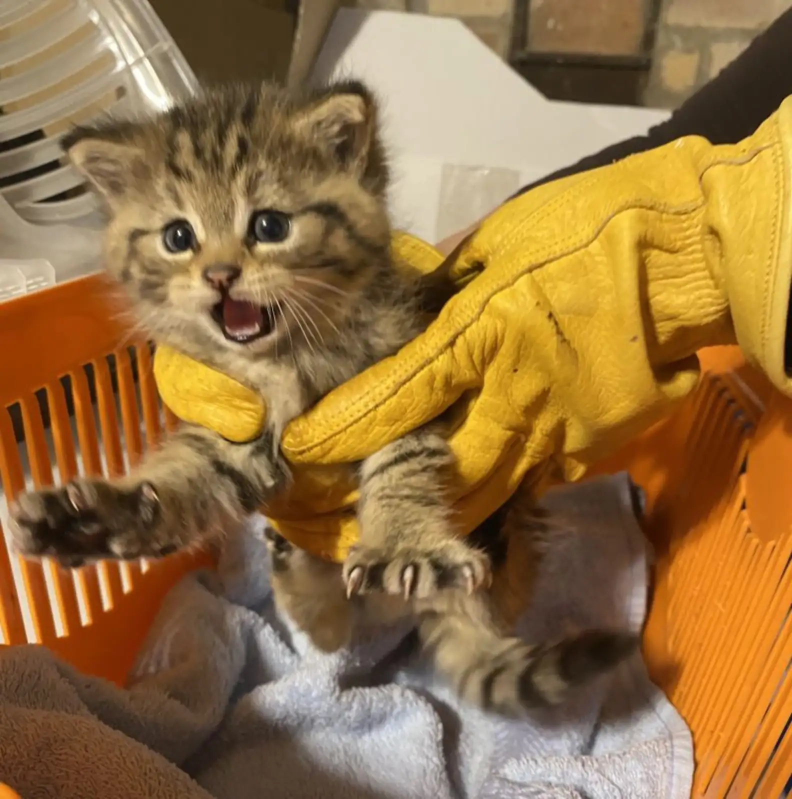

<br>
<div align="center">

</div>
[image source](https://www.thedodo.com/daily-dodo/shelter-staff-realize-fierce-little-rescue-kitten-isnt-who-she-seems)

```{r, include = FALSE}
library(tidyverse)
library(hms)
library(patchwork)
library(glmnet)

park_ranger = read_csv("data/Urban_Park_Ranger_Animal_Condition_Response_20251103.csv") %>% 
  janitor::clean_names() %>% 
  mutate(
    date_and_time_of_initial_call = mdy_hm(date_and_time_of_initial_call),
    date_and_time_of_ranger_response = mdy_hm(date_and_time_of_ranger_response),
    
    call_date = as.Date(date_and_time_of_initial_call),
    call_time = as_hms(date_and_time_of_initial_call),
    response_date = as.Date(date_and_time_of_ranger_response),
    response_time = as_hms(date_and_time_of_ranger_response)
  ) %>% 
  filter(date_and_time_of_ranger_response >= date_and_time_of_initial_call) %>% 
  rename(duration_of_action = duration_of_response)

park_ranger_new = park_ranger %>% 
  mutate(
    animal_class_new = case_when(
      animal_class %in% c(
        "[\"Birds\"]", "[\"Raptors\"]", "Birds", "Raptors", 
        "Raptors, Small Mammals-RVS"
      ) ~ "Birds / Raptors",
            
      animal_class %in% c(
        "[\"Small Mammals-non RVS\"]", "[\"Small Mammals-RVS\"]",
        "Small Mammals-non RVS", "Small Mammals-RVS"
      ) ~ "Small Mammals",
      
      animal_class %in% c(
        "Coyotes", "Deer", "[\"Coyotes\"]", "[\"Deer\"]"
      ) ~ "Large Mammals",

      animal_class %in% c(
        "[\"Marine Mammals-whales, Dolphin\"]", "[\"Marine Mammals-seals only\"]",
        "Marine Mammals-seals only", "Marine Mammals-whales,  Dolphin", 
        "Marine Mammals-whales, Dolphin"
      ) ~ "Marine Mammals",
            
      animal_class %in% c(
        "[\"Fish-numerous quantity\"]", "[\"Non Native Fish-(invasive)\"]", 
        "Fish-numerous quantity", "Fish-numerous quantity;#Terrestrial Reptile or Amphibian", 
        "Non Native Fish-(invasive)"
      ) ~ "Fish",
      
      animal_class %in% c(
        "[\"Marine Reptiles\"]", "[\"Terrestrial Reptile or Amphibian\"]", 
        "Marine Reptiles", "Terrestrial Reptile or Amphibian", 
        "Terrestrial Reptile or Amphibian, Fish-numerous quantity"
      ) ~ "Reptiles / Amphibians",

      animal_class %in% c(
        "[\"Rare, Endangered, Dangerous\"]", "Rare,  Endangered,  Dangerous",
        "Rare, Endangered, Dangerous"
      ) ~ "Others",
      
      species_description %in% c(
        "Atlantic Canary","Bird (Unknown)","Budgerigar","Budgerigar Parakeet",
        "Chicken","Chukar","Cockatiel","Domestic Dove","Domestic Duck", "Domestic duck",
        "Domestic Goose","Domestic Goose Hybrid","Domestic Quail","Domestic Turkey",
        "Domestic Waterfowl","Fancy Dove","Guinea Fowl","Guineafowl","Japanese Quail",
        "Khaki Campbell","Muscovy Duck","Rock Dove",
        "Parakeet (Unknown)"
      ) ~ "Birds / Raptors",
      
      species_description %in% c(
        "Domestic Rabbit","Domestic Ferret","Fancy Rat","Gerbil",
        "Guinea Pig", "Guniea Pig", "Guinea pig", "Hamster"
      ) ~ "Small Mammals",
      
      species_description %in% c(
        "Dog","Pitt Bull Mix","Cat","Goat","Cattle","Pig"
      ) ~ "Large Mammals",
      
      species_description %in% c(
        "Animal (Unknown)","Honey Bee", "Unknown","N/A"
      ) ~ "Others"),
    
    animal_class_new = factor(animal_class_new, 
                              levels = c("Birds / Raptors", "Small Mammals", "Large Mammals", 
                                         "Marine Mammals", "Reptiles / Amphibians", "Fish", "Others")),
    
    borough = factor(borough, levels = c("Manhattan", "Brooklyn", "Queens", "Bronx", "Staten Island")),
    
    call_source = factor(call_source, levels = c("Public", "Central", "Employee", 
                                                 "Conservancies/\"Friends of\" Groups", 
                                                 "Observed by Ranger", "WBF", "WINORR", "Other")),
    
    species_status = ifelse(species_status == "N/A" | is.na(species_status), 
                            "Unknown", species_status),
    species_status = factor(species_status, levels = c("Native", "Invasive", "Domestic", 
                                                       "Exotic", "Unknown")),
    
    animal_condition = ifelse(animal_condition == "N/A" | is.na(animal_condition), 
                              "Unknown", animal_condition),
    animal_condition = factor(animal_condition, levels = c("Healthy", "Unhealthy", "Injured", 
                                                           "DOA", "Unknown")),
    
    adult   = if_else(str_detect(age, "Adult"), 1L, 0L, missing = 0L),
    juvenile = if_else(str_detect(age, "Juvenile"), 1L, 0L, missing = 0L),
    infant  = if_else(str_detect(age, "Infant"), 1L, 0L, missing = 0L)
  )
```