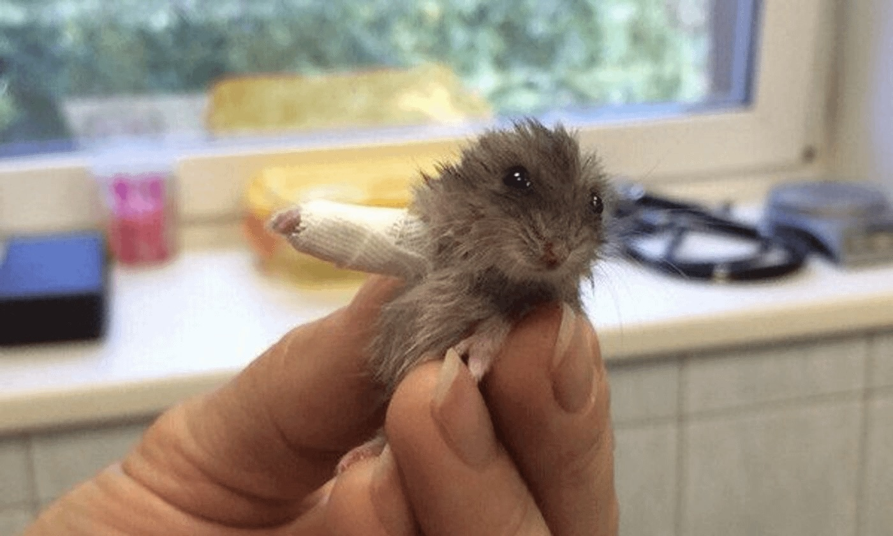
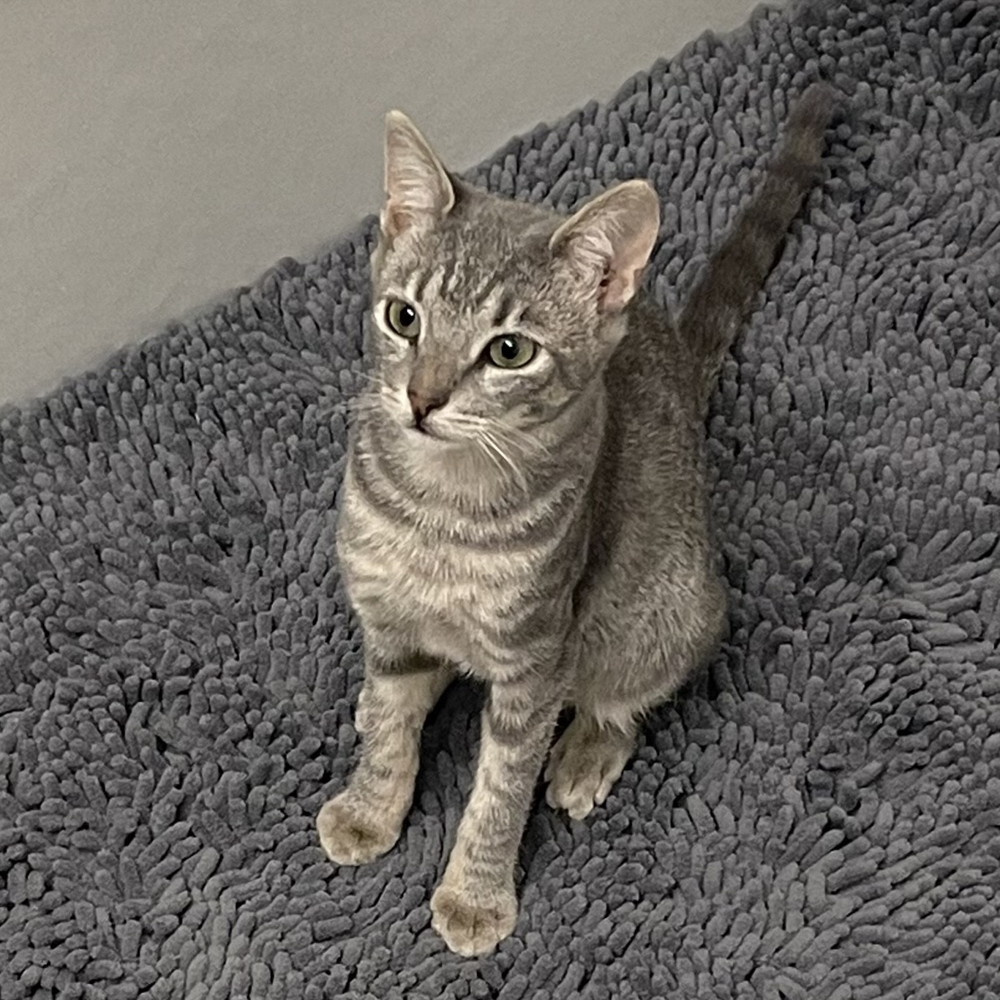

```{r setup, message = FALSE, include=FALSE}
source("data_cleaning.R")
library(leaflet)
library(sf)
knitr::opts_chunk$set(
  fig.width = 6,
  fig.asp = .8,
  out.width = "90%",
  dpi = 200
)
```

## A Data Story of Seasonal and Spatial Animal Saving

---

<div style="text-align:center;">
  
</div>

<div style="text-align:center; font-size:12px; color:#666;">
  Little hamster with its little cast.<br>
  Image Credit: Reddit / GeorgeOnee
</div>


Animals play an essential role in maintaining ecological balance, yet those living in New York City often face unique challenges. By analyzing the [Urban Park Ranger Animal Condition Response](https://data.cityofnewyork.us/Environment/Urban-Park-Ranger-Animal-Condition-Response/fuhs-xmg2/about_data) dataset, we aim to understand when and where animals require the most help. Our goal is to raise public awareness and support timely rescue and conservation efforts across the city. 

This dataset, provided by the Department of Parks and Recreation (DPR), contains 6,385 records of animal rescue requests from May 2018 to June 2024, including detailed information such as the date and time of each call, ranger response time, park name or location, animal species, the condition of the animals involved, and ranger final action. About 25.4% of the reports came from the general public, while 40.1% were reported by trained personnel including park rangers, park employees, and wildlife organizations.

---

### Where Do Animal Rescue Calls Occur?

```{r, collapse=TRUE}
# for each row, create the popup content including borough and number of cases (>0) for each animal class
# convert WKT multipolygon strings into sf multipolygon geometry for mapping
map_park_sf = map_park |>
  rowwise() |>
  mutate(
    animal_text = {
      case_num = c_across(all_of(animal_classes))
      case_num_index = !is.na(case_num)
      case_num_order = order(case_num[case_num_index], decreasing = TRUE)
      paste0(
        animal_classes[case_num_index][case_num_order], ": ",
        case_num[case_num_index][case_num_order],
        collapse = "<br>")},
    popup_content = paste0(
      "<b>", signname, ", </b>",
      borough, "<br>",
      animal_text)) |>
  ungroup() |> 
  st_as_sf(wkt = "multipolygon", crs = 4326)

# create a function to create color based on the total number of case reported
density_color = colorBin(
  palette = c("#c9e0e5", "#bed2c6", "#ffd19d", "#feb29b", "#ed8687"),
  bins = c(0, 5, 20, 100, 300, max(map_park$total_n)),
  domain = map_park$total_n
)

border_color = colorBin(
  palette = c("#7db7c8", "#6ab883", "#f2a84a", "#f0735b", "#d44c4e"),
  bins = c(0, 5, 20, 100, 300, max(map_park$total_n)),
  domain = map_park$total_n
)

# map with leaflet
# use CartoDB.Voyager tile layer
# fill in color using density_color based on total_n
# add a minimap
leaflet(map_park_sf, height = 500) |> 
  addProviderTiles("CartoDB.Voyager") |>
  addPolygons(
    color = ~border_color(total_n),
    weight = 1,
    opacity = 2,
    fillColor = ~density_color(total_n),
    fillOpacity = 0.9,
    popup = ~popup_content
  ) |> 
  addMiniMap(toggleDisplay = TRUE) |> 
  addLegend(
    pal = density_color,
    values = ~total_n,
    title = "Total Cases",
    position = "topright",
    opacity = 1)
```

The [Parks Properties](https://data.cityofnewyork.us/Recreation/Parks-Properties/enfh-gkve/about_data) dataset was used to map the locations of parks associated with each reported animal case. After fuzzy matching and manual review, 35 unique property values remained unmatched, mostly street names or parks not included in the official dataset. The final map includes 6,118 reported cases across 546 unique parks.

---

### Screen Cast

add video

---

### Meet the Team

<div style="display:flex; justify-content:center; gap:60px; flex-wrap:nowrap; margin-top:30px;">

<!-- Sam -->
<div style="width:180px; text-align:center;">
  
  <div style="margin-top:10px; font-size:16px; font-weight:bold;">Samantha Xinwei Han</div>
  <a href="mailto:xh2601@cumc.columbia.edu" style="text-decoration:none; color:#444;">
    <i class="fa fa-envelope" style="font-size:18px;"></i>
    <span style="font-size:14px; margin-left:5px;">xh2601@cumc.columbia.edu</span>
  </a>
</div>


<!-- Linda -->
<div style="width:180px; text-align:center;">
  
  <div style="margin-top:10px; font-size:16px; font-weight:bold;">Xinhui (Linda) Lin</div>
  <a href="mailto:xl3054@cumc.columbia.edu" style="text-decoration:none; color:#444;">
    <i class="fa fa-envelope" style="font-size:18px;"></i>
    <span style="font-size:14px; margin-left:5px;">xl3054@cumc.columbia.edu</span>
  </a>
</div>

<!-- Ruohan -->
<div style="width:180px; text-align:center;">
  
  <div style="margin-top:10px; font-size:16px; font-weight:bold;">Ruohan Lyu</div>
  <a href="mailto:rl3610@cumc.columbia.edu" style="text-decoration:none; color:#444;">
    <i class="fa fa-envelope" style="font-size:18px;"></i>
    <span style="font-size:14px; margin-left:5px;">rl3610@cumc.columbia.edu</span>
  </a>
</div>

</div>

<div style="display:flex; justify-content:center; gap:60px; flex-wrap:nowrap; margin-top:30px;">

<!-- Xinyin -->
<div style="width:180px; text-align:center;">
  
  <div style="margin-top:10px; font-size:16px; font-weight:bold;">Xinyin Miao</div>
  <a href="mailto:xm2356@cumc.columbia.edu" style="text-decoration:none; color:#444;">
    <i class="fa fa-envelope" style="font-size:18px;"></i>
    <span style="font-size:14px; margin-left:5px;">xm2356@cumc.columbia.edu</span>
  </a>
</div>

<!-- Fenglin -->
<div style="width:180px; text-align:center;">
  
  <div style="margin-top:10px; font-size:16px; font-weight:bold;">Fenglin Xie</div>
  <a href="mailto:fx2212@cumc.columbia.edu" style="text-decoration:none; color:#444;">
    <i class="fa fa-envelope" style="font-size:18px;"></i>
    <span style="font-size:14px; margin-left:5px;">fx2212@cumc.columbia.edu</span>
  </a>
</div>

</div>

