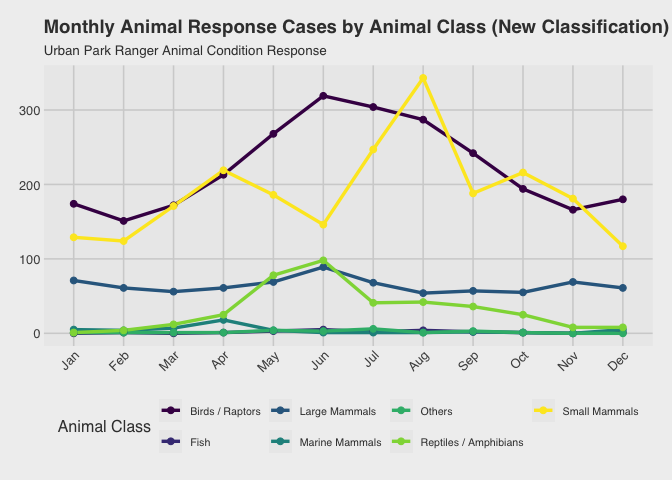
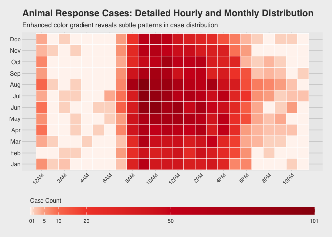

p8105_final_project
================
Xinwei Han (xh2601), Xinhui Lin (xl3054), Ruohan Lyu (rl3610), Xinyin
Miao (xm2356), Fenglin Xie (fx2212)
2025-12-06

load packages

``` r
library(tidyverse)
```

    ## ── Attaching core tidyverse packages ──────────────────────── tidyverse 2.0.0 ──
    ## ✔ dplyr     1.1.4     ✔ readr     2.1.5
    ## ✔ forcats   1.0.1     ✔ stringr   1.5.2
    ## ✔ ggplot2   4.0.0     ✔ tibble    3.3.0
    ## ✔ lubridate 1.9.4     ✔ tidyr     1.3.1
    ## ✔ purrr     1.1.0     
    ## ── Conflicts ────────────────────────────────────────── tidyverse_conflicts() ──
    ## ✖ dplyr::filter() masks stats::filter()
    ## ✖ dplyr::lag()    masks stats::lag()
    ## ℹ Use the conflicted package (<http://conflicted.r-lib.org/>) to force all conflicts to become errors

``` r
library(hms)
```

    ## 
    ## Attaching package: 'hms'
    ## 
    ## The following object is masked from 'package:lubridate':
    ## 
    ##     hms

``` r
library(lubridate)
library(viridis)
```

    ## Loading required package: viridisLite

``` r
library(ggthemes)
library(scales)
```

    ## 
    ## Attaching package: 'scales'
    ## 
    ## The following object is masked from 'package:viridis':
    ## 
    ##     viridis_pal
    ## 
    ## The following object is masked from 'package:purrr':
    ## 
    ##     discard
    ## 
    ## The following object is masked from 'package:readr':
    ## 
    ##     col_factor

Data cleaning: remove incorrect records based on call & response time,
split date and time

``` r
park_ranger = read_csv("data/Urban_Park_Ranger_Animal_Condition_Response_20251103.csv") %>% 
  janitor::clean_names() %>% 
  mutate(
    date_and_time_of_initial_call = mdy_hm(date_and_time_of_initial_call),
    date_and_time_of_ranger_response = mdy_hm(date_and_time_of_ranger_response),
    
    call_date = as.Date(date_and_time_of_initial_call),
    call_time = as_hms(date_and_time_of_initial_call),
    response_date = as.Date(date_and_time_of_ranger_response),
    response_time = as_hms(date_and_time_of_ranger_response)  ## split date and time
  ) %>% 
  filter(date_and_time_of_ranger_response >= date_and_time_of_initial_call)
```

    ## Rows: 6385 Columns: 22
    ## ── Column specification ────────────────────────────────────────────────────────
    ## Delimiter: ","
    ## chr (15): Date and Time of initial call, Date and time of Ranger response, B...
    ## dbl  (3): Duration of Response, # of Animals, Hours spent monitoring
    ## lgl  (4): PEP Response, Animal Monitored, Police Response, ESU Response
    ## 
    ## ℹ Use `spec()` to retrieve the full column specification for this data.
    ## ℹ Specify the column types or set `show_col_types = FALSE` to quiet this message.

Reclassify animal classes into 7 categories

``` r
park_ranger_new = park_ranger %>% 
  mutate(
    animal_class_new = case_when(
      species_description %in% c(
        "Atlantic Canary","Bird (Unknown)","Budgerigar","Budgerigar Parakeet",
        "Chicken","Chukar","Cockatiel","Domestic Dove","Domestic Duck", "Domestic duck",
        "Domestic Goose","Domestic Goose Hybrid","Domestic Quail","Domestic Turkey",
        "Domestic Waterfowl","Fancy Dove","Guinea Fowl","Guineafowl","Japanese Quail",
        "Khaki Campbell","Muscovy Duck","Rock Dove",
        "Parakeet (Unknown)"
      ) ~ "Birds / Raptors",
      
      species_description %in% c(
        "Domestic Rabbit","Domestic Ferret","Fancy Rat","Gerbil",
        "Guinea Pig", "Guniea Pig", "Guinea pig", "Hamster"
      ) ~ "Small Mammals",
      
      species_description %in% c(
        "Dog","Pitt Bull Mix","Cat","Goat","Cattle","Pig"
      ) ~ "Large Mammals",
      
      species_description %in% c(
        "Animal (Unknown)","Honey Bee", "Unknown","N/A"
      ) ~ "Others",
      
      animal_class %in% c(
        "[\"Birds\"]", "[\"Raptors\"]", "Birds", "Raptors", 
        "Raptors, Small Mammals-RVS"
      ) ~ "Birds / Raptors",
            
      animal_class %in% c(
        "[\"Small Mammals-non RVS\"]", "[\"Small Mammals-RVS\"]",
        "Small Mammals-non RVS", "Small Mammals-RVS"
      ) ~ "Small Mammals",
      
      animal_class %in% c(
        "Coyotes", "Deer", "[\"Coyotes\"]", "[\"Deer\"]"
      ) ~ "Large Mammals",

      animal_class %in% c(
        "[\"Marine Mammals-whales, Dolphin\"]", "[\"Marine Mammals-seals only\"]",
        "Marine Mammals-seals only", "Marine Mammals-whales,  Dolphin", 
        "Marine Mammals-whales, Dolphin"
      ) ~ "Marine Mammals",
            
      animal_class %in% c(
        "[\"Fish-numerous quantity\"]", "[\"Non Native Fish-(invasive)\"]", 
        "Fish-numerous quantity", "Fish-numerous quantity;#Terrestrial Reptile or Amphibian", 
        "Non Native Fish-(invasive)"
      ) ~ "Fish",
      
      animal_class %in% c(
        "[\"Marine Reptiles\"]", "[\"Terrestrial Reptile or Amphibian\"]", 
        "Marine Reptiles", "Terrestrial Reptile or Amphibian", 
        "Terrestrial Reptile or Amphibian, Fish-numerous quantity"
      ) ~ "Reptiles / Amphibians",

      animal_class %in% c(
        "[\"Rare, Endangered, Dangerous\"]", "Rare,  Endangered,  Dangerous",
        "Rare, Endangered, Dangerous"
      ) ~ "Others"
    )
  )
```

``` r
table(park_ranger_new$animal_class_new)
```

    ## 
    ##       Birds / Raptors                  Fish         Large Mammals 
    ##                  2670                    20                   771 
    ##        Marine Mammals                Others Reptiles / Amphibians 
    ##                    49                    22                   378 
    ##         Small Mammals 
    ##                  2267

# TASK 1: Monthly trends by animal class using the new classification

``` r
monthly_animal_trends = park_ranger_new |> 
  mutate(
    call_month = month(date_and_time_of_initial_call, label = TRUE, abbr = TRUE)
  ) |> 
  group_by(call_month, animal_class_new) |> 
  summarise(case_count = n(), .groups = "drop") |> 
  # Ensure all months are represented for each animal class
  complete(call_month, animal_class_new, fill = list(case_count = 0))
```

# Plot 1: Monthly trends by animal class (new classification)

``` r
mon_case_plot = monthly_animal_trends |> 
  ggplot(aes(x = call_month, y = case_count, group = animal_class_new, color = animal_class_new)) +
  geom_line(linewidth = 1.2) +
  geom_point(size = 2) +
  scale_y_continuous(breaks = pretty_breaks()) +
  labs(
    title = "Monthly Animal Response Cases by Animal Class (New Classification)",
    subtitle = "Urban Park Ranger Animal Condition Response",
    x = "Month",
    y = "Number of Cases",
    color = "Animal Class"
  ) +
  theme_fivethirtyeight() +
  theme(
    axis.text.x = element_text(angle = 45, hjust = 1),
    legend.position = "bottom",
    plot.title = element_text(face = "bold", size = 14),
    plot.subtitle = element_text(size = 10),
    legend.text = element_text(size = 8)
  ) +
  scale_color_viridis_d()

print(mon_case_plot)
```

<!-- -->

Chart Interpretation:

This line chart displays the monthly distribution of animal response
cases across 7 reclassified animal categories throughout the year.

Key Findings:

1.  Birds and raptors demonstrate a notable increase in cases beginning
    in February, reaching a peak in June, and declining to their lowest
    levels by November, possibly reflecting migratory patterns, nesting
    seasons, and reduced activity during colder months.

2.  Small mammals exhibit three distinct peaks in case numbers during
    April, August, and October, which may suggest potential associations
    with breeding cycles, seasonal resource availability, or periodic
    human-wildlife interactions in urban environments.

3.  Large mammals maintain relatively consistent case numbers between 70
    and 80 throughout the year, indicating potentially stable population
    dynamics or continuous human encounters despite seasonal variations.

4.  Reptiles and amphibians show generally low and stable case numbers
    with a moderate peak around 100 in June, which might be linked to
    temperature-dependent activity patterns and increased visibility
    during warmer conditions.

5.  Marine mammals and other categories remain consistently minimal with
    case counts in the single digits, possibly due to their limited
    presence in urban park ecosystems or lower detection rates.

# TASK 2: Heatmap of cases by month and hour (using cleaned data)

``` r
hourly_monthly_heatmap = park_ranger_new |> 
  mutate(
    call_month = month(date_and_time_of_initial_call, label = TRUE, abbr = TRUE),
    call_hour = hour(date_and_time_of_initial_call)
  ) |> 
  filter(!is.na(call_month) & !is.na(call_hour)) |> 
  group_by(call_month, call_hour) |> 
  summarise(case_count = n(), .groups = "drop") |> 
  complete(call_month, call_hour, fill = list(case_count = 0))
```

Create custom color gradient with more detailed breaks

``` r
max_cases = max(hourly_monthly_heatmap$case_count)
color_breaks = c(0, 1, 5, 10, 20, 50, max_cases)
```

Define red color palette

``` r
red_palette = colorRampPalette(c("#FFF5F0", "#FEE0D2", "#FCBBA1", "#FC9272", "#FB6A4A", "#EF3B2C", "#CB181D", "#99000D"))(length(color_breaks))
```

# Plot 2: Heatmap of cases by month and hour

``` r
case_heatmap = hourly_monthly_heatmap |>
  ggplot(aes(x = call_hour, y = call_month, fill = case_count)) +
  geom_tile(color = "white", linewidth = 0.3) +
  scale_fill_gradientn(
    name = "Case Count",
    colors = red_palette,
    values = rescale(color_breaks),
    breaks = color_breaks,
    guide = guide_colorbar(
      barwidth = 30,
      barheight = 0.8,
      direction = "horizontal",
      title.position = "top"
    )
  ) +
  scale_x_continuous(
    breaks = seq(0, 23, by = 2),
    labels = c("12AM", "2AM", "4AM", "6AM", "8AM", "10AM", 
               "12PM", "2PM", "4PM", "6PM", "8PM", "10PM")
  ) +
  labs(
    title = "Animal Response Cases: Detailed Hourly and Monthly Distribution",
    subtitle = "Enhanced color gradient reveals subtle patterns in case distribution",
    x = "Hour of Day",
    y = "Month"
  ) +
  theme_fivethirtyeight() +
  theme(
    axis.text.x = element_text(angle = 45, hjust = 1, size = 8),
    axis.text.y = element_text(size = 9),
    plot.title = element_text(face = "bold", size = 14),
    plot.subtitle = element_text(size = 10),
    legend.position = "bottom",
    legend.title = element_text(size = 9),
    legend.text = element_text(size = 8)
  )

plot(case_heatmap)
```

<!-- -->

## Time-Month Heatmap Analysis:

Case distribution primarily concentrates between 8:00 and 18:00,
aligning with peak park visitation and diurnal animal activity. Summer
exhibits extended evening activity likely due to increased daylight and
recreational use, while winter shows contracted midday patterns
corresponding to reduced daylight availability. Minimal overnight
reporting may reflect limited detection capabilities during
low-human-activity periods.

## Human Intervention Recommendations:

Enhanced ranger coverage during summer afternoons could address elevated
case frequencies across multiple species. Early spring public education
initiatives might mitigate conflicts by raising awareness of seasonal
animal behaviors. Rescue organizations should anticipate increased
warm-weather intake while utilizing winter for strategic planning.
Visitor vigilance during peak seasons and prompt daylight reporting
could improve response effectiveness, supplemented by community
monitoring programs and coordinated rehabilitation networks.
