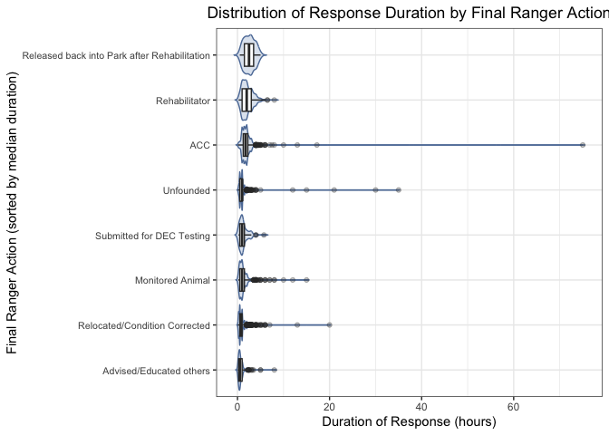
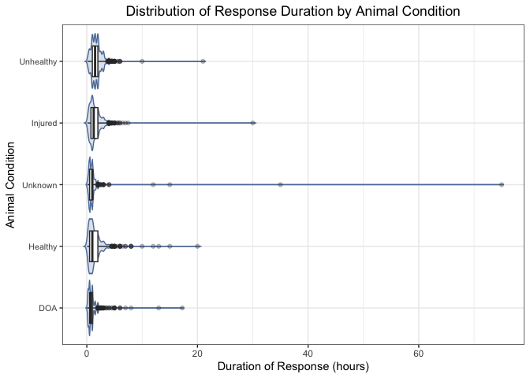
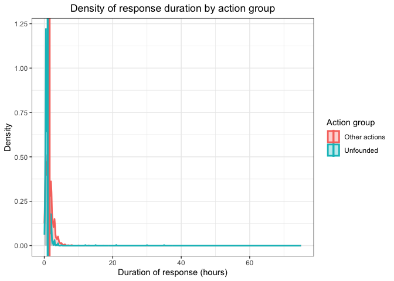
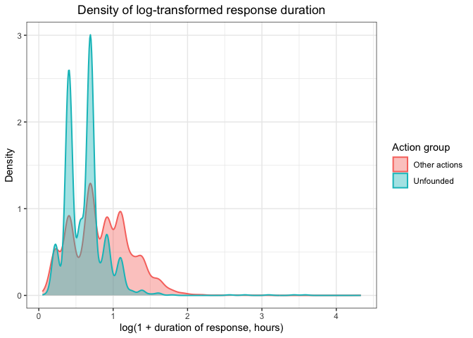
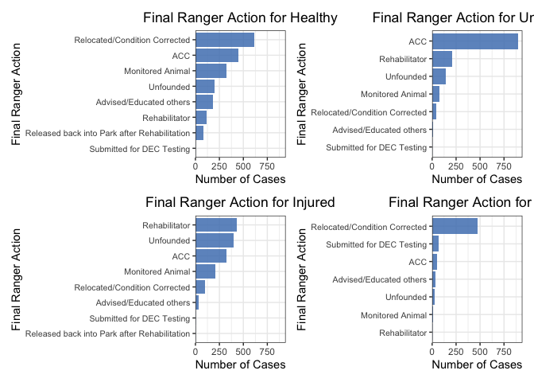

p8105_final_project
================
Xinwei Han (xh2601), Xinhui Lin (xl3054), Ruohan Lyu (rl3610), Xinyin
Miao (xm2356), Fenglin Xie (fx2212)
2025-12-06

Load packages:

``` r
library(tidyverse)
library(hms)
library(lubridate)
library(viridis)
library(ggthemes)
library(scales)
library(glmnet)
library(patchwork)
```

Data cleaning:

- Split date and time

- Remove incorrect records based on call & response time

- Rename variable `duration_of_response` to `duration_of_action`

``` r
park_ranger = read_csv("data/Urban_Park_Ranger_Animal_Condition_Response_20251103.csv") %>% 
  janitor::clean_names() %>% 
  mutate(
    date_and_time_of_initial_call = mdy_hm(date_and_time_of_initial_call),
    date_and_time_of_ranger_response = mdy_hm(date_and_time_of_ranger_response),
    
    call_date = as.Date(date_and_time_of_initial_call),
    call_time = as_hms(date_and_time_of_initial_call),
    response_date = as.Date(date_and_time_of_ranger_response),
    response_time = as_hms(date_and_time_of_ranger_response)
  ) %>% 
  filter(date_and_time_of_ranger_response >= date_and_time_of_initial_call) %>% 
  rename(duration_of_action = duration_of_response)
```

    ## Rows: 6385 Columns: 22
    ## ── Column specification ─────────────────────────────────────
    ## Delimiter: ","
    ## chr (15): Date and Time of initial call, Date and time of Ranger response, B...
    ## dbl  (3): Duration of Response, # of Animals, Hours spent monitoring
    ## lgl  (4): PEP Response, Animal Monitored, Police Response, ESU Response
    ## 
    ## ℹ Use `spec()` to retrieve the full column specification for this data.
    ## ℹ Specify the column types or set `show_col_types = FALSE` to quiet this message.

- Reclassify animal classes into 7 categories

- Factor categorical variables & set reference level

``` r
park_ranger_new = park_ranger %>% 
  mutate(
    animal_class_new = case_when(
      animal_class %in% c(
        "[\"Birds\"]", "[\"Raptors\"]", "Birds", "Raptors", 
        "Raptors, Small Mammals-RVS"
      ) ~ "Birds / Raptors",
            
      animal_class %in% c(
        "[\"Small Mammals-non RVS\"]", "[\"Small Mammals-RVS\"]",
        "Small Mammals-non RVS", "Small Mammals-RVS"
      ) ~ "Small Mammals",
      
      animal_class %in% c(
        "Coyotes", "Deer", "[\"Coyotes\"]", "[\"Deer\"]"
      ) ~ "Large Mammals",

      animal_class %in% c(
        "[\"Marine Mammals-whales, Dolphin\"]", "[\"Marine Mammals-seals only\"]",
        "Marine Mammals-seals only", "Marine Mammals-whales,  Dolphin", 
        "Marine Mammals-whales, Dolphin"
      ) ~ "Marine Mammals",
            
      animal_class %in% c(
        "[\"Fish-numerous quantity\"]", "[\"Non Native Fish-(invasive)\"]", 
        "Fish-numerous quantity", "Fish-numerous quantity;#Terrestrial Reptile or Amphibian", 
        "Non Native Fish-(invasive)"
      ) ~ "Fish",
      
      animal_class %in% c(
        "[\"Marine Reptiles\"]", "[\"Terrestrial Reptile or Amphibian\"]", 
        "Marine Reptiles", "Terrestrial Reptile or Amphibian", 
        "Terrestrial Reptile or Amphibian, Fish-numerous quantity"
      ) ~ "Reptiles / Amphibians",

      animal_class %in% c(
        "[\"Rare, Endangered, Dangerous\"]", "Rare,  Endangered,  Dangerous",
        "Rare, Endangered, Dangerous"
      ) ~ "Others",
      
      species_description %in% c(
        "Atlantic Canary","Bird (Unknown)","Budgerigar","Budgerigar Parakeet",
        "Chicken","Chukar","Cockatiel","Domestic Dove","Domestic Duck", "Domestic duck",
        "Domestic Goose","Domestic Goose Hybrid","Domestic Quail","Domestic Turkey",
        "Domestic Waterfowl","Fancy Dove","Guinea Fowl","Guineafowl","Japanese Quail",
        "Khaki Campbell","Muscovy Duck","Rock Dove",
        "Parakeet (Unknown)"
      ) ~ "Birds / Raptors",
      
      species_description %in% c(
        "Domestic Rabbit","Domestic Ferret","Fancy Rat","Gerbil",
        "Guinea Pig", "Guniea Pig", "Guinea pig", "Hamster"
      ) ~ "Small Mammals",
      
      species_description %in% c(
        "Dog","Pitt Bull Mix","Cat","Goat","Cattle","Pig"
      ) ~ "Large Mammals",
      
      species_description %in% c(
        "Animal (Unknown)","Honey Bee", "Unknown","N/A"
      ) ~ "Others"),
    
    animal_class_new = factor(animal_class_new, 
                              levels = c("Birds / Raptors", "Small Mammals", "Large Mammals", 
                                         "Marine Mammals", "Reptiles / Amphibians", "Fish", "Others")),
    
    borough = factor(borough, levels = c("Manhattan", "Brooklyn", "Queens", "Bronx", "Staten Island")),
    
    call_source = factor(call_source, levels = c("Public", "Central", "Employee", 
                                                 "Conservancies/\"Friends of\" Groups", 
                                                 "Observed by Ranger", "WBF", "WINORR", "Other")),
    
    species_status = ifelse(species_status == "N/A" | is.na(species_status), 
                            "Unknown", species_status),
    species_status = factor(species_status, levels = c("Native", "Invasive", "Domestic", 
                                                       "Exotic", "Unknown")),
    
    animal_condition = ifelse(animal_condition == "N/A" | is.na(animal_condition), 
                              "Unknown", animal_condition),
    animal_condition = factor(animal_condition, levels = c("Healthy", "Unhealthy", "Injured", 
                                                           "DOA", "Unknown")),
    
    adult   = if_else(str_detect(age, "Adult"), 1L, 0L, missing = 0L),
    juvenile = if_else(str_detect(age, "Juvenile"), 1L, 0L, missing = 0L),
    infant  = if_else(str_detect(age, "Infant"), 1L, 0L, missing = 0L)
  )
```

``` r
table(park_ranger_new$animal_class_new)
```

    ## 
    ##       Birds / Raptors         Small Mammals         Large Mammals 
    ##                  2672                  2270                   770 
    ##        Marine Mammals Reptiles / Amphibians                  Fish 
    ##                    49                   378                    20 
    ##                Others 
    ##                    18

# TASK 1: Monthly trends by animal class using the new classification

``` r
monthly_animal_trends = park_ranger_new |> 
  mutate(
    call_month = month(date_and_time_of_initial_call, label = TRUE, abbr = TRUE)
  ) |> 
  group_by(call_month, animal_class_new) |> 
  summarise(case_count = n(), .groups = "drop") |> 
  # Ensure all months are represented for each animal class
  complete(call_month, animal_class_new, fill = list(case_count = 0))
```

# Plot 1: Monthly trends by animal class (new classification)

``` r
mon_case_plot = monthly_animal_trends |> 
  ggplot(aes(x = call_month, y = case_count, group = animal_class_new, color = animal_class_new)) +
  geom_line(linewidth = 1.2) +
  geom_point(size = 2) +
  scale_y_continuous(breaks = pretty_breaks()) +
  labs(
    title = "Monthly Animal Response Cases by Animal Class (New Classification)",
    subtitle = "Urban Park Ranger Animal Condition Response",
    x = "Month",
    y = "Number of Cases",
    color = "Animal Class"
  ) +
  theme_fivethirtyeight() +
  theme(
    axis.text.x = element_text(angle = 45, hjust = 1),
    legend.position = "bottom",
    plot.title = element_text(face = "bold", size = 14),
    plot.subtitle = element_text(size = 10),
    legend.text = element_text(size = 8)
  ) +
  scale_color_viridis_d()

print(mon_case_plot)
```

<!-- -->

Chart Interpretation:

This line chart displays the monthly distribution of animal response
cases across 7 reclassified animal categories throughout the year.

Key Findings:

1.  Birds and raptors demonstrate a notable increase in cases beginning
    in February, reaching a peak in June, and declining to their lowest
    levels by November, possibly reflecting migratory patterns, nesting
    seasons, and reduced activity during colder months.

2.  Small mammals exhibit three distinct peaks in case numbers during
    April, August, and October, which may suggest potential associations
    with breeding cycles, seasonal resource availability, or periodic
    human-wildlife interactions in urban environments.

3.  Large mammals maintain relatively consistent case numbers between 70
    and 80 throughout the year, indicating potentially stable population
    dynamics or continuous human encounters despite seasonal variations.

4.  Reptiles and amphibians show generally low and stable case numbers
    with a moderate peak around 100 in June, which might be linked to
    temperature-dependent activity patterns and increased visibility
    during warmer conditions.

5.  Marine mammals and other categories remain consistently minimal with
    case counts in the single digits, possibly due to their limited
    presence in urban park ecosystems or lower detection rates.

# TASK 2: Heatmap of cases by month and hour (using cleaned data)

``` r
hourly_monthly_heatmap = park_ranger_new |> 
  mutate(
    call_month = month(date_and_time_of_initial_call, label = TRUE, abbr = TRUE),
    call_hour = hour(date_and_time_of_initial_call)
  ) |> 
  filter(!is.na(call_month) & !is.na(call_hour)) |> 
  group_by(call_month, call_hour) |> 
  summarise(case_count = n(), .groups = "drop") |> 
  complete(call_month, call_hour, fill = list(case_count = 0))
```

Create custom color gradient with more detailed breaks

``` r
max_cases = max(hourly_monthly_heatmap$case_count)
color_breaks = c(0, 1, 5, 10, 20, 50, max_cases)
```

Define red color palette

``` r
red_palette = colorRampPalette(c("#FFF5F0", "#FEE0D2", "#FCBBA1", "#FC9272", "#FB6A4A", "#EF3B2C", "#CB181D", "#99000D"))(length(color_breaks))
```

# Plot 2: Heatmap of cases by month and hour

``` r
case_heatmap = hourly_monthly_heatmap |>
  ggplot(aes(x = call_hour, y = call_month, fill = case_count)) +
  geom_tile(color = "white", linewidth = 0.3) +
  scale_fill_gradientn(
    name = "Case Count",
    colors = red_palette,
    values = rescale(color_breaks),
    breaks = color_breaks,
    guide = guide_colorbar(
      barwidth = 30,
      barheight = 0.8,
      direction = "horizontal",
      title.position = "top"
    )
  ) +
  scale_x_continuous(
    breaks = seq(0, 23, by = 2),
    labels = c("12AM", "2AM", "4AM", "6AM", "8AM", "10AM", 
               "12PM", "2PM", "4PM", "6PM", "8PM", "10PM")
  ) +
  labs(
    title = "Animal Response Cases: Detailed Hourly and Monthly Distribution",
    subtitle = "Enhanced color gradient reveals subtle patterns in case distribution",
    x = "Hour of Day",
    y = "Month"
  ) +
  theme_fivethirtyeight() +
  theme(
    axis.text.x = element_text(angle = 45, hjust = 1, size = 8),
    axis.text.y = element_text(size = 9),
    plot.title = element_text(face = "bold", size = 14),
    plot.subtitle = element_text(size = 10),
    legend.position = "bottom",
    legend.title = element_text(size = 9),
    legend.text = element_text(size = 8)
  )

plot(case_heatmap)
```

<!-- -->

Time-Month Heatmap Analysis:

Case distribution primarily concentrates between 8:00 and 18:00,
aligning with peak park visitation and diurnal animal activity. Summer
exhibits extended evening activity likely due to increased daylight and
recreational use, while winter shows contracted midday patterns
corresponding to reduced daylight availability. Minimal overnight
reporting may reflect limited detection capabilities during
low-human-activity periods.

## Human Intervention Recommendations:

Enhanced ranger coverage during summer afternoons could address elevated
case frequencies across multiple species. Early spring public education
initiatives might mitigate conflicts by raising awareness of seasonal
animal behaviors. Rescue organizations should anticipate increased
warm-weather intake while utilizing winter for strategic planning.
Visitor vigilance during peak seasons and prompt daylight reporting
could improve response effectiveness, supplemented by community
monitoring programs and coordinated rehabilitation networks.

# TASK 7

``` r
park_model = park_ranger_new |>
  rename(num_animals = matches("animals")) |>
  mutate(
    duration_hours      = as.numeric(duration_of_action),
    num_animals         = as.numeric(num_animals),
    final_ranger_action = as.factor(final_ranger_action),
    animal_condition    = as.factor(animal_condition)
  ) |>
  filter(
    !is.na(duration_hours),
    duration_hours > 0,
    !is.na(final_ranger_action),
    !is.na(animal_condition),
    !is.na(num_animals),
    num_animals >= 0
  )
```

# Relationship Between Response Duration and Final Ranger Action

``` r
action_order <- park_model |>
  group_by(final_ranger_action) |>
  summarise(med = median(duration_hours, na.rm = TRUE)) |>
  arrange(med) |>
  pull(final_ranger_action)

park_model2 <- park_model |>
  mutate(final_ranger_action = factor(final_ranger_action, levels = action_order))

ggplot(park_model2, aes(x = final_ranger_action, y = duration_hours)) +

  # Violin plot
  geom_violin(trim = FALSE, fill = "#BFCDE0", color = "#5D7CA6", alpha = 0.5, scale = "width") +

  # Boxplot
  geom_boxplot(width = 0.5, fill = "white", outlier.alpha = 0.3) +

  coord_flip() +

  labs(
    title = "Distribution of Response Duration by Final Ranger Action",
    x = "Final Ranger Action (sorted by median duration)",
    y = "Duration of Response (hours)"
  ) +

  theme_bw() +
  theme(
    plot.title = element_text(hjust = 0.5),
    axis.text.y = element_text(size = 8)
  )
```

<!-- -->

Chart Interpretation:

The combined violin-and-boxplot visualization provides insight into how
long Urban Park Rangers spend responding to different types of
animal-related incidents.

1.  Actions Involving Rehabilitation Have the Longest Response Durations

Final actions such as “Released back into Park after Rehabilitation” and
“Rehabilitator” show the highest median response durations, as well as
the widest spread of times.

These actions often require: on-site assessment, coordination with
licensed wildlife rehabilitators, transport of animals, or extended
monitoring before the animal can be safely released.

As a result, longer rescue times are expected. The long right-tails in
these distributions reflect occasional cases that require many hours of
handling or follow-up visits.

2.  Administrative or Low-Intervention Actions Are Generally Short

Actions such as: “Advised/Educated others”, “Submitted for DEC Testing”,
“Relocated/Condition Corrected”, “Monitored Animal” show much shorter
median durations.

These categories often represent cases where: the ranger provides
guidance to the public, conducts a quick field assessment, performs
minor relocation, or verifies that an animal is behaving normally.

Because they involve limited physical intervention, these responses tend
to be resolved quickly, reflected in the tight, compact violins and
small IQRs.

3.  “Unfounded” and “ACC” Responses Show High Variability

ACC (Animal Care Center Transfer): While the median duration is
moderate, the long right tail indicates that some cases require
significant time—often due to: waiting for ACC personnel to arrive,
multi-agency coordination, or handling distressed or dangerous animals.

Unfounded: Although typically short, several cases show unusually long
durations. These may correspond to: extended attempts to locate an
animal that was ultimately not found, misreported incidents requiring
prolonged investigation, or delays in confirming that no intervention
was needed.

4.  Outliers Reflect a Small Number of Long-Duration Incidents

Across multiple actions—especially ACC, Unfounded, and
Rehabilitator—there are visible outliers extending to 30+ hours. These
are likely: long-term monitoring cases, situations requiring multiple
returns to the site, or logistical delays in handing off animals to
rehabilitation partners.

# Relationship Between Animal Condition and Response Duration

``` r
park_model <- park_ranger_new |>
  rename(num_animals = matches("animals")) |>
  mutate(
    duration_hours      = as.numeric(duration_of_action),
    num_animals         = as.numeric(num_animals),

    animal_condition    = as.character(animal_condition),
    animal_condition    = ifelse(animal_condition == "N/A", "Unknown", animal_condition),

    final_ranger_action = as.factor(final_ranger_action),
    animal_condition    = as.factor(animal_condition)
  ) |>
  filter(
    !is.na(duration_hours),
    duration_hours > 0,
    !is.na(final_ranger_action),
    !is.na(animal_condition),
    !is.na(num_animals),
    num_animals >= 0
  )

park_model2 <- park_model |>
  mutate(
    animal_condition = fct_reorder(
      animal_condition,
      duration_hours,
      .fun = median,
      na.rm = TRUE))

ggplot(park_model2, aes(x = animal_condition, y = duration_hours)) +
  # Violin layer
  geom_violin(trim = FALSE, fill = "#BFCDE0", color = "#5D7CA6",
              alpha = 0.5, scale = "width") +
  
  # Boxplot layer
  geom_boxplot(width = 0.5, fill = "white", outlier.alpha = 0.3) +
  
  coord_flip() +
  
  labs(
    title = "Distribution of Response Duration by Animal Condition",
    x = "Animal Condition",
    y = "Duration of Response (hours)"
  ) +
  
  theme_bw() +
  theme(
    plot.title = element_text(hjust = 0.5),
    axis.text.y = element_text(size = 8)
  )
```

<!-- -->

The violin-and-boxplot visualization shows how response time varies
across different animal conditions.

1.  Unhealthy and Injured Animals Tend to Receive Longer Responses

The Unhealthy and Injured categories show slightly higher median
response durations and wider distributions.

This pattern is expected because these cases usually require detailed
on-site assessment, safe handling of distressed animals, and possibly
coordination with rehabilitation partners.

2.  Healthy Animals Show Shorter and More Consistent Response Times

The Healthy category has a shorter median response duration and a
narrower distribution. Healthy animals often require quick verification
that no intervention is needed, or simple relocation or observation.

3.  Unknown Conditions Have High Variability

The Unknown group displays substantial variation, including several
long-duration outliers. These likely reflect situations where limited
information during the call required extended investigation, or the
ranger spent additional time determining whether intervention was
necessary.

4.  DOA Cases Involve Minimal Handling but Occasionally Long
    Investigations

The DOA (Dead on Arrival) category generally shows short median
durations, consistent with the limited intervention required. However,
some notable long-duration outliers appear—possibly tied to:
coordinating with external agencies (e.g., ACC), species identification
procedures, or waiting for specialized disposal assistance.

# Density of Response Duration by Action Group

``` r
park_model2 = park_model |>
  mutate(
    action_group = if_else(
      final_ranger_action == "Unfounded",
      "Unfounded",
      "Other actions"
    )
  )
```

``` r
duration_mean = park_model2 |>
  group_by(action_group) |>
  summarise(
    mean_duration = mean(duration_hours, na.rm = TRUE),
    .groups = "drop"
  )
duration_mean
```

    ## # A tibble: 2 × 2
    ##   action_group  mean_duration
    ##   <chr>                 <dbl>
    ## 1 Other actions         1.54 
    ## 2 Unfounded             0.995

## Density Plot

``` r
ggplot(park_model2, aes(x = duration_hours,
                        fill  = action_group,
                        color = action_group)) +
  geom_density(alpha = 0.3, adjust = 1, linewidth = 1) +
  
  geom_vline(data = duration_mean,
             aes(xintercept = mean_duration, color = action_group),
             linewidth = 1.2) +
  
  labs(
    title = "Density of response duration by action group",
    x = "Duration of response (hours)",
    y = "Density",
    fill  = "Action group",
    color = "Action group"
  ) +
  theme_bw() +
  theme(
    plot.title = element_text(hjust = 0.5)
  )
```

<!-- -->

The first density plot shows that the distribution of raw response
duration is extremely right-skewed, with most incidents resolved within
a short time but a small number taking many hours. This heavy skew makes
it difficult to visually compare “Unfounded” cases with all other ranger
actions on the original scale because the long tail compresses the main
density near zero.

## Density Plot (log-transformed)

``` r
park_model2_log = park_model2 |>
  filter(duration_hours > 0) |>
  mutate(duration_log = log1p(duration_hours))  # log(1 + x)

ggplot(park_model2_log,
       aes(x = duration_log, fill = action_group, color = action_group)) +
  geom_density(alpha = 0.4, adjust = 1, linewidth = 0.7) +
  labs(
    title = "Density of log-transformed response duration",
    x = "log(1 + duration of response, hours)",
    y = "Density",
    fill  = "Action group",
    color = "Action group"
  ) +
  theme_bw() +
  theme(
    plot.title = element_text(hjust = 0.5)
  )
```

<!-- -->

To address this issue, we applied a log-transformation, using log(1 +
duration).

This transformation compresses long-duration outliers and spreads out
the dense mass near zero, making group differences more interpretable
and improving visualization.

Comparison Between Unfounded and Other Actions:

1.  Unfounded cases

Display a higher density at lower log-duration values, indicating that
these calls are typically resolved very quickly.

The mean duration of unfounded responses is approximately 1.0 hour,
confirming their shorter nature.

2.  Other actions

Show a broader distribution with higher density at larger log-duration
values, meaning that these incidents often require more time for
assessment, handling, or coordination.

Their mean duration is significantly higher at 1.52 hours.

# Statistic: ANOVA Models for Response Duration

## ANOVA on Raw Duration

``` r
anova_fit = aov(
  duration_hours ~ final_ranger_action * animal_condition + num_animals,
  data = park_model
)

summary(anova_fit)
```

    ##                                        Df Sum Sq Mean Sq F value Pr(>F)    
    ## final_ranger_action                     7   1519  216.94  97.825 <2e-16 ***
    ## animal_condition                        4      6    1.57   0.706  0.588    
    ## num_animals                             1      4    4.27   1.924  0.165    
    ## final_ranger_action:animal_condition   24    492   20.51   9.249 <2e-16 ***
    ## Residuals                            6127  13588    2.22                   
    ## ---
    ## Signif. codes:  0 '***' 0.001 '**' 0.01 '*' 0.05 '.' 0.1 ' ' 1

The original ANOVA model: duration_hours ~ final_ranger_action \*
animal_condition + num_animals

It shows:

Final ranger action is highly significant (p \< 2e-16), indicating
strong differences in response duration across action types.

Animal condition is not significant (p = 0.46) in the raw model.

Number of animals has no effect (p = 0.80).

The interaction between final action and condition is significant (p =
0.000165), suggesting that the effect of action type depends on the
condition of the animal.

## Log-Transformed ANOVA

``` r
park_model2 = park_model |>
  filter(duration_hours > 0) |>
  mutate(log_duration = log(duration_hours))

anova_fit_log = aov(
  log_duration ~ final_ranger_action * animal_condition + num_animals,
  data = park_model2
)

summary(anova_fit_log)
```

    ##                                        Df Sum Sq Mean Sq F value   Pr(>F)    
    ## final_ranger_action                     7 1037.5  148.22 357.609  < 2e-16 ***
    ## animal_condition                        4    7.9    1.96   4.736 0.000816 ***
    ## num_animals                             1    0.6    0.65   1.564 0.211132    
    ## final_ranger_action:animal_condition   24   29.1    1.21   2.924 2.27e-06 ***
    ## Residuals                            6127 2539.5    0.41                     
    ## ---
    ## Signif. codes:  0 '***' 0.001 '**' 0.01 '*' 0.05 '.' 0.1 ' ' 1

``` r
par(mfrow = c(1, 2))
plot(anova_fit_log, which = 1)  # Residuals vs Fitted
plot(anova_fit_log, which = 2)  # Normal Q-Q
```

    ## Warning: not plotting observations with leverage one:
    ##   4660, 5064

<!-- -->

``` r
par(mfrow = c(1, 1))
```

Because response duration is highly right-skewed with many long-tail
outliers, ANOVA assumptions were violated when using raw duration
values. This motivated the use of a log-transformation to stabilize
variance and improve normality of residuals.

Model: log_duration ~ final_ranger_action \* animal_condition +
num_animals

The results:

Final ranger action remains highly significant (p \< 2e-16), confirming
strong differences in rescue duration across action types even after
transformation.

Animal condition becomes significant (p = 0.000416), suggesting that
after correcting skewness and long tails, condition differences emerge
more clearly.

Number of animals remains non-significant (p = 0.27).

Interaction term remains significant (p = 7.3e-07), indicating that the
influence of action types varies across conditions.

The log-transformation compresses extreme high-duration responses and
spreads out low values, resulting in more homogeneous variance across
fitted values , more normal residual distribution, clearer signal for
predictors previously overshadowed by extreme right-skewed values.

This is evident in the diagnostics:

Residuals vs fitted plot shows more stable variance.

Q–Q plot is much closer to the reference line, though long-tail
deviations still exist (expected with field-based rescue data).

# Task 8: Final Ranger Actions by Animal Condition

``` r
library(patchwork)
park_model4 <- park_model |>
  filter(!is.na(animal_condition)) |>
  filter(animal_condition %in% c("Healthy", "Unhealthy", "Injured", "DOA"))
```

``` r
plot_condition_bar <- function(data, cond, ymax) {

  df <- data |>
    filter(animal_condition == cond) |>
    count(final_ranger_action) |>
    arrange(n)

  df$final_ranger_action <- factor(df$final_ranger_action,
                                   levels = df$final_ranger_action)

  ggplot(df, aes(x = final_ranger_action, y = n)) +
    geom_col(fill = "#4F81BD", alpha = 0.85) +
    coord_flip() +
    scale_y_continuous(limits = c(0, ymax),
                       expand = expansion(mult = c(0, 0.05))) +
    labs(
      title = paste("Final Ranger Action for", cond),
      x = "Final Ranger Action",
      y = "Number of Cases") +
    theme_bw() +
    theme(
      plot.title = element_text(hjust = 0.5),
      axis.text.y = element_text(size = 8))
}
max_cases <- park_model4 |>
  count(animal_condition, final_ranger_action) |>
  pull(n) |>
  max()

p1 <- plot_condition_bar(park_model4, "Healthy",   max_cases)
p2 <- plot_condition_bar(park_model4, "Unhealthy", max_cases)
p3 <- plot_condition_bar(park_model4, "Injured",   max_cases)
p4 <- plot_condition_bar(park_model4, "DOA",       max_cases)

(p1 | p2) /
(p3 | p4)
```

<!-- -->

The four-panel visualization compares how ranger actions differ
depending on the animal’s condition at the time of the call.

1.  Healthy Animals

For Healthy animals, the most common actions are: relocated / condition
corrected, ACC.

These results suggest that many healthy animals were either moved from
unsafe locations or transferred to the Animal Care Center for further
evaluation. Lower-frequency actions (e.g., rehabilitation) reflect that
healthy animals rarely require intensive care.

2.  Unhealthy Animals

In the Unhealthy group, ACC overwhelmingly dominates as the most
frequent action, followed by Rehabilitator.

Because unhealthy animals typically need medical evaluation or long-term
care, leading to high ACC involvement. Minimal counts in actions like
“Submitted for DEC Testing” or “Relocated” indicate that relocation
alone is usually insufficient for visibly unhealthy cases.

3.  Injured Animals

For Injured animals, the dominant actions are rehabilitator, unfounded,
ACC.

Injured animals frequently require hands-on treatment or rehabilitation.
The relatively high number of “Unfounded” cases likely reflects
situations where the animal could not be located or its condition
improved by the time the ranger arrived.

4.  DOA Animals

Among DOA cases, the most common action is relocated / condition
corrected.

This is because dead wildlife generally require removal from public
spaces rather than medical intervention. The presence of some actions
like ACC transfer or DEC Testing reflects cases where the animal needed
identification or documentation before final handling.
